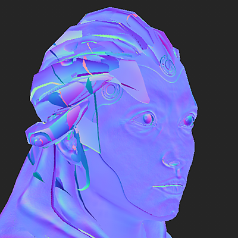
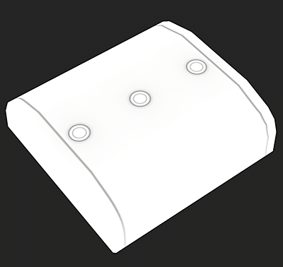

# 名前による照合

名前によるマッチングは、名前に基づいてローポリメッシュとハイポリメッシュを分離するためにSubstance Bakersで使用できるフィルタリング方法の名前です。

この機能は、ベーキングプロセス中にジオメトリが互いににじんでテクスチャが滑らかになることを防ぐのに非常に便利です。 同じ結果を得るために、メッシュを移動する必要がなくなります（「爆発」と呼ばれることもあります）。

## 名前による照合を使用する場合

### メッシュのブリードによる法線マップのベイク処理

この例では、キャラクターの頭の上にあるヘルメットがキャラクターの顔に裁ち落とされます。

名前によるマッチングを有効にすると、ヘルメットを無視して顔を適切にベイクすることができます。 *この結果は、メインの一致の設定に基づいています。*

| *メッシュ* | *名前による一致をオフ* | *名前で一致* |
| --- | --- | --- |
| {width="250px"} | {width="250px"} | {width="250px"} |

### 浮動ジオメトリの背面を無視

この例では、ボックスの上部にある「ボタン」はフローティングジオメトリであり、高ポリゴンメッシュには接続されていません。 したがって、デフォルトでは、ジオメトリの境界を示す下のボックスにシャドウを投影します。

**背面を無視**&#x200B;設定で名前による一致を有効にすると、ボタンの下の領域を無視して1つのボックスのように見える環境オクルージョンをベイク処理できます。*この結果は、[背面を無視]設定の使用に基づいています。*

| *メッシュ* | *名前による一致をオフ* | *名前で一致* |
| --- | --- | --- |
| {width="250px"} | {width="250px"} | {width="250px"} |

## 名前による照合の仕組み

[名前によるマッチング]システムは、ローポリゴンメッシュとハイポリゴンメッシュの両方のジオメトリ名を読み取り、キーワード（接尾辞）を使用して名前を識別またはマッチングします。 デフォルトでは、ベイカーは特定の接尾辞を使用しますが、変更することもできます（以下を参照）。

現在サポートされているサフィックスは次のとおりです。

| *サフィックスの種類* | *既定値* | *使用方法* |
| --- | --- | --- |
| 高ポリゴン | *\_high* | 低ポリゴンメッシュと一致するように、高ポリゴンメッシュの名前を分離するために使用します。 |
| ローポリ | *\_low* | 低ポリゴンメッシュの名前を分離して、高ポリゴンメッシュと一致させるために使用します。 |
| 背面を無視 | *\_ignorebf* | アンビエントオクルージョンなどのセカンダリレイを使用しているベーカーの背面を無視するために使用します。*この接尾辞は、ハイポリメッシュにのみ存在する必要があります（例：**mesh\_high\_ignorebf***） |

この機能を正しく動作させるために考慮すべきルールは、次のとおりです。

* 既定では&#x200B;**オフ**&#x200B;であるため、[共通パラメーター](../../bakers-settings/common-parameters/common-parameters.md)で名前による一致を有効にする必要があります。
* 一部のパン屋（[アンビエントオクルージョン](../../bakers-settings/ambient-occlusion-from/ambient-occlusion-from-mesh.md)など）では、セカンダリレイが発生するため、名前による二次的な一致の設定が有効になっている場合があります。
* 一致では大文字と小文字が区別されます。つまり、「**Vela**」という名前のメッシュは、「**vela**」という名前の別のメッシュと一致しません。
* ジオメトリ名に接尾辞が存在する場所に基づいて、複数のメッシュを一致させることができます。

次に、照合の例を示します（デフォルトの接尾辞を使用）。

| ローポリゴン名 | 高ポリゴンと一致します | 高ポリゴンと一致しません |
| --- | --- | --- |
| <ul data-preserve-html="true"><li data-preserve-html="true">body_low</li></ul> | <ul data-preserve-html="true"><li data-preserve-html="true">body_high</li><li data-preserve-html="true">body_high_top</li><li data-preserve-html="true">body_high_1</li><li data-preserve-html="true">body_high_2</li></ul> | <ul data-preserve-html="true"><li data-preserve-html="true">体高の</li><li data-preserve-html="true">body_top_high</li></ul> |
| <ul data-preserve-html="true"><li data-preserve-html="true">Head_low</li></ul> | <ul data-preserve-html="true"><li data-preserve-html="true">Head_high</li></ul> | <ul data-preserve-html="true"><li data-preserve-html="true">head_high</li></ul> |
| <ul data-preserve-html="true"><li data-preserve-html="true">Leg_low_top</li></ul> | <ul data-preserve-html="true"><li data-preserve-html="true">Leg_high</li><li data-preserve-html="true">Leg_high_top</li><li data-preserve-html="true">Leg_high_high_top</li></ul> | <ul data-preserve-html="true"><li data-preserve-html="true">Leg_top_high</li></ul> |

## パン屋の設置方法

### 名前による一致を有効にする

名前による一致は、Baker設定の[共通パラメーター](../../bakers-settings/common-parameters/common-parameters.md)で有効にできます。

| *ソフトウェア* | *構成の設定* |
| --- | --- |
| **Substance Painter** | <ol class="steps" data-preserve-html="true"> <li class="step" data-preserve-html="true">     (テクスチャセット(Texture Set)設定を使用して)ベイクウィンドウを開きます。    </li> <li class="step" data-preserve-html="true">     共通パラメータを表示します。    </li> <li class="step" data-preserve-html="true">     設定<strong>一致</strong>を「常に」から「メッシュ名で」に変更します。      </li> </ol> |
| **Substance Designer** | <ol class="steps" data-preserve-html="true"> <li class="step" data-preserve-html="true">     ベイクウィンドウを開きます（Explorerウィンドウでリンクされたメッシュを右クリックして開きます）。    </li> <li class="step" data-preserve-html="true">     設定<strong>一致</strong>を「常に」から「メッシュ名で」に変更します。       </li> </ol> |

### サフィックス名の変更

デフォルトの接尾辞は\_lowと\_highで、以下のように変更できます。

* **Substance Painter**: [ベイクウィンドウ](../../getting-started/software-interface/3d-painter/substance-3d-painter.md)で、共通パラメーター内にあります。
* **Substance Designer**: [プロジェクト設定](https://experienceleague.adobe.com/en/docs/substance-3d-designer/using/workspace/preferences/project-settings)で、ベイク処理の設定の下にあります。

## zBrushのHigh-polyメッシュ

zBrushから書き出されたHigh-polyメッシュは、[名前によるマッチング]機能を使用してベイク処理に使用できますが、次のような設定になります。

| *ファイル形式* | *説明* |
| --- | --- |
| **FBX** | 有効/無効にする特定のパラメータがないため、メッシュファイルをそのまま使用できます。 |
| **オブジェクト** | zBrushで書き出されたOBJファイルは、既定では&#x200B;**名前による一致**&#x200B;で機能しません。 代わりに、メッシュファイル名を使用してメッシュを名前で一致させるようSubstance Painterに指示することもできます。そのためには、次のことを確認してください。<ol data-preserve-html="true"><li data-preserve-html="true"><strong>各</strong>サブツールのグループ(Grp)パラメーターを<strong>無効</strong>にします。</li><li data-preserve-html="true">OBJファイルを適切に<strong>名前</strong>にします（例： <strong>body_high.obj</strong>）。</li></ol>  |
