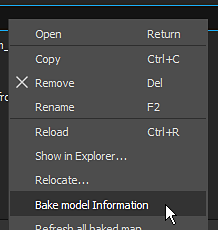
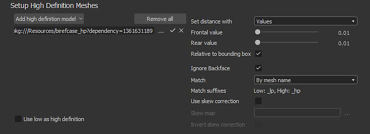

# Substance 3D Designer

ベイクウィンドウには、[エクスプローラー](https://helpx.adobe.com/substance-3d/unlisted/documentation/sddoc/the-explorer-129368147.html)ウィンドウのメッシュファイルを使用してアクセスできます。 メッシュ名を右クリックして「**モデル情報をベイク処理**」を選択し、ベイク処理ウィンドウを開きます。

## 概要

{width="500px"}

のベーキングウィンドウは、以下に説明するいくつかのパネルに分割されています。

### ベイクする要素

このパネルは、ベイク処理に使用するローポリメッシュの部分を制御します。

このパネルには、ローポリゴンメッシュファイル内にあるジオメトリが一覧表示されます。 デフォルトでは、リストはファイル内で見つかった個々のマテリアルに基づいていますが、関連する場合は代わりにサブメッシュに切り替えることができます。 ベイクプロセス中に無視する要素のチェックを外すことができます。

### 出力

このパネルは、ベイク処理されたテクスチャの配置場所を制御します。

| *パラメーター* | *説明* |
| --- | --- |
| **メソッド** | ベイク処理されたテクスチャをSubstanceパッケージと一緒に格納する方法を制御します。有効な値：<ul data-preserve-html="true"><li data-preserve-html="true"><strong>埋め込み</strong> ：ベイク処理されたテクスチャは、特定の名前でSubstanceパッケージの横にあるサブフォルダーに保存されます。</li><li data-preserve-html="true"><strong>リンク</strong> （デフォルト） ：ベイク処理されたテクスチャは定義されたフォルダーに保存され、パッケージ化されたSubstanceー内で参照されます。</li></ul> |
| **フォルダー** | 保存時のベイク処理されたテクスチャの場所。 3つのドットボタンをクリックしてファイルダイアログを開き、書き出しフォルダーを選択します。右側にチェックマークが表示され、フォルダーが実際に存在するかどうかが示されます。 |
| **名前** | ベイク処理されたテクスチャの命名規則。 3つのドットボタンをクリックしてドロップダウンを開き、他のプレースホルダー（ベーカネーム、カスタム、マテリアル、メッシュ）を挿入します。 |
| **サンプル** | ファイル名をシミュレートして、命名規則をテストします。 |
| **メッシュ固有のフォルダーにリソースを配置する** | 有効な場合、ベイク処理されたテクスチャはメッシュファイルという名前のフォルダに保存されます。 |

### 高精細メッシュ

このパネルは、ハイポリゴンメッシュリストおよび関連する設定をコントロールします。 詳細については、[共通パラメーター](../../../bakers-settings/common-parameters/common-parameters.md)を参照してください。

### デフォルト値

詳細については、[共通パラメーター](../../../bakers-settings/common-parameters/common-parameters.md)を参照してください。

### パン屋のリストと設定

ベーカーでは、生成するベイクテクスチャを選択できます。 デフォルトでは、リストは空です。

* **新しいパン屋を追加しています：** [パン屋の追加]ボタンをクリックしてください。
* **ベイカーを削除する：**&#x200B;リストからベイカーを選択し、「Delete baker」ボタンをクリックします。
* **パン屋を一番上に移動する：**&#x200B;リストでパン屋を選択し、[一番上に移動]をクリックします。
* **Moving down a baker:**リストでパン屋を選択し、「Push down」ボタンをクリックします。

継承の各ベイカーは、デフォルトでデフォルト値（上記を参照）を使用します。 たとえば、サイズ（解像度）は、パン屋の行のセルをクリックして上書きできます。 これは、線上の他の設定についても同様です。

リスト内のベイカーをクリックすると、ベイカーパラメータービューが特定のパラメーターで更新されます。

特定のパラメーターの詳細については、「[ベイカー設定](../../../bakers-settings/bakers-settings.md)」を参照してください。
