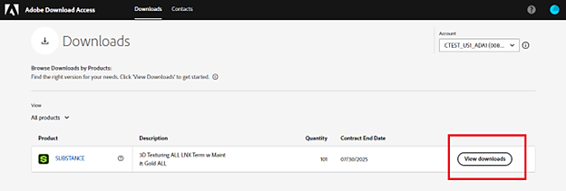
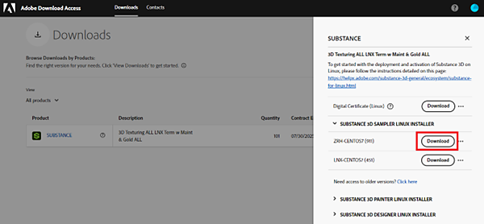

# 導入ガイド

Enterprise ContractでSubstance 3D for Linux®を購入すると、対応するAdobeとライセンスが[製品ダウンロードアクセス(ADA)](https://download-access.adobe.com/lws/downloads)ポータルで提供されます。 ソフトウェアを正常にデプロイするには、ADAからソフトウェアビルドとライセンスキーファイルの両方をダウンロードする必要があります。

## ソフトウェアビルドとライセンスキーファイルをダウンロードします。

[Adobeのダウンロードアクセス](https://download-access.adobe.com/lws/downloads)にサインインします。 ソフトウェアのビルドとライセンスキーのファイルを見つけます。

1. アカウントドロップダウンを使用して、Substance 3D Linuxを購入したアカウントを選択します。

   
1. ページのヘッダーにあるリンクをクリックして、「ダウンロード」に移動します。

   
1. 対応する製品で「ダウンロードを表示」をクリックします。

   
1. ADAはこのIDに関連付けられたライセンス情報を読み込み、下の表に表示します。
1. 「デジタル証明書」の行で「ダウンロード」をクリックし、ライセンスキーファイルを含むzipファイルをダウンロードします。

   * zipファイルには、製品ごとに1つのライセンスキーが含まれています。
   * ライセンスキーを使用すると、ライセンスが認証された各コンピューターで製品をライセンス認証できます。

   
1. 「Substance 3D」Sampler、Painter、Designerをクリックして、Substance 3D Painter、Substance 3D Designer、Substance 3D Samplerのソフトウェアビルドを表示します。
1. 「ダウンロード」をクリックして、インストールする製品のインストールファイルをダウンロードします。

   
1. 「ソフトウェアのダウンロード」通知がポップアップ表示されます。 「accept」をクリック

   

## インストールとライセンス認証

ソフトウェアをインストールするには：

1. 製品のEXEファイルをダブルクリックして、インストールウィザードを開始します。
1. インストール手順に従って、インストールを完了します。

ソフトウェアのライセンス認証には、ローカルライセンス認証とネットワークライセンス認証の2つのオプションがあります。

### ローカルのライセンス認証

1. ADAからダウンロードしたzipフォルダーを解凍します。
1. アクティベートするソフトウェアを起動します。
1. ライセンス認証ウィザードで、[ライセンスキーファイルを使用してライセンス認証する]を選択します。

   
1. [参照]をクリックし、対応するライセンスキーファイルの場所をポイントします。
1. [次へ]をクリックして、ソフトウェアのライセンス認証を行います。

### ネットワークのアクティブ化

1. ADAからダウンロードしたzipフォルダーを解凍します。
1. 解凍したライセンスキーファイルを共有マウントされたネットワークに配置します。
1. ユーザーのマシンで、次のページの説明に従って、ライセンス・キー・ファイルを指す環境変数を設定します。

   * Substance 3D Painter - <https://experienceleague.adobe.com/ja/docs/substance-3d-painter/using/pipeline-and-integration/configuration/environment-variables>
   * Substance 3D Designer - <https://experienceleague.adobe.com/ja/docs/substance-3d-designer/using/pipeline-and-project-configuration/environment-variables>
   * Substance 3D Sampler - <https://experienceleague.adobe.com/ja/docs/substance-3d-sampler/using/pipeline-and-integrations/environment-variables>
