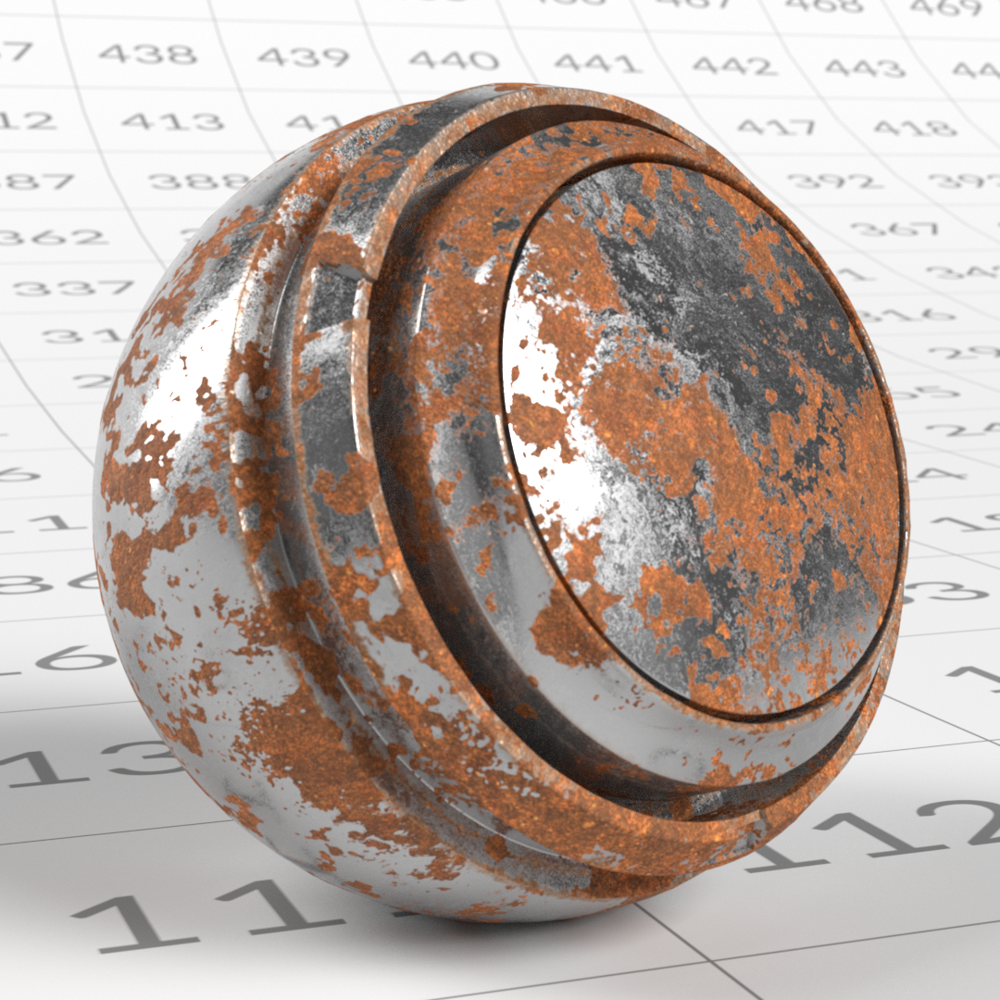
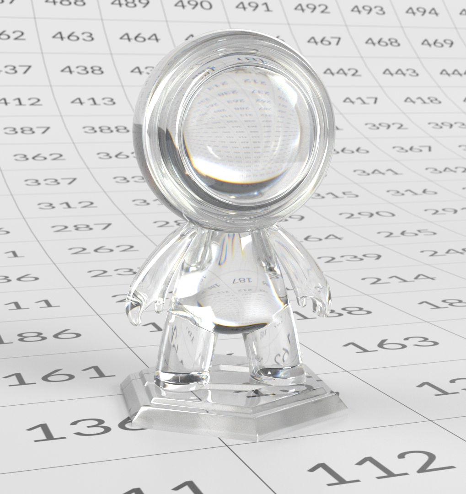

# OpenPBR

[**このページのオフラインバージョンをダウンロードします。**](../assets/openpbrf/openpbr.pdf)

**OpenPBR**&#x200B;は、さまざまな3Dツール、レンダラー、パイプラインのマテリアルを表現するための一貫性のある予測可能な手段を提供するように設計された、オープンで物理的に基づいたサーフェスシェーディングモデルです。 このモデルは、さまざまな実世界のサーフェスを表現できる1つの包括的なマテリアルモデルを定義すると同時に、物理的に意味のあるパラメータを使用して、より定型化された、アーティスト主導の外観をサポートする十分な柔軟性を備えています。

このモデルは、名前は似ているがパラメータ定義やアプリケーション間の物理的な前提が異なる「標準」シェーダ間の長年にわたる矛盾に対処します。 OpenPBRは、物理的なレンダリングの原則に基づいて、マテリアルを実際の光の挙動、省エネ、直感的なパラメーター範囲、安定した照明応答の観点から説明します。 OpenPBRでは、特定のユーザーインターフェイスを規定するのではなく、基本レベルでのマテリアルの動作を定義します。これにより、ツールは独自の方法でモデルを実装しながら、アプリケーションとパイプライン間のアセットの移動に応じて一貫した視覚結果を維持できます。

このドキュメントは、アーティストに焦点を当てた、OpenPBRを理解して操作するためのガイドです。 モデルの基礎となる原理、その構成要素が実際の光の動きをどのように表すのか、そしてそれらのアイデアがどのように実際の物質創造に変換されるのかを説明します。 このガイドは、特定のアプリケーションに焦点を当てるのではなく、外観の開発、テクスチャリング、レンダリングなどの分野で作業する3Dアーティストを対象としています。これらのアーティストは、物理的に納得のいく、堅牢なマテリアルを構築し、異なるソフトウェア環境間で一貫性を保ち、転送できるようにすることを望んでいます。

>[!NOTE]
>
> 既にOpenPBRに関する作業を行っており、技術的なサポートをお探しの場合は、[OpenPBRに関するFAQ](openpbr-faq.md)に既にお問い合わせがある可能性があります。

*上記のOpenPBRデモシーンは、Nikie Monteleoneによって作成されました。 このドキュメントのマテリアルおよびチャネルレンダリングの例は、Celine Dameronによって作成されました。*

## 相互運用性とファイル標準

### OpenPBRを含む共通のマテリアル言語

OpenPBRの重要な目標の1つは、工具間の材料の動きを良くすることです。 OpenPBRは、1つのレンダラーやアプリケーションに結び付けられたシェーダではなく、**共有シェーディングモデル**&#x200B;を定義します。これは、マテリアルが光にどのように反応するかを表す一般的な方法です。

つまり、アーティストにとってOpenPBRマテリアルとは、たとえば「Adobeマテリアル」や「Autodeskマテリアル」だけではなく、複数のツールで原理的に理解できるサーフェスとボリュームのビヘイビアーを記述したものです。 その目的は、あるアプリケーションで作成されたマテリアルがOpenPBRモデルをサポートしている限り、そのマテリアルを別の場所で一貫して解釈できるようにすることです。

### 資産交換の問題

OpenPBR仕様は、プロダクションにおける長年の課題を明確に認めています。**アプリケーション間でマテリアルがうまく移動しません**。 レンダラが異なると、パラメータ名、シェーディングの前提、基本モデルも異なることが多いため、外観を一致させるのは困難で時間がかかります。

OpenPBRは、この問題への対応策として設計されています。 金属、誘電体、層状物質、透過、散乱などの一般的な生産ニーズをカバーする単一の物理的に接地されたマテリアルモデルを定義することで、安定した交換目標を提供します。 これは、すべての状況で完全な視覚的な一致を保証するものではありませんが、独自のシェーダモデルと比較してあいまいさは大幅に軽減されます。

アーティストにとって現実的なテイクアウトとは、*意図*&#x200B;の維持をOpenPBRの目的とすることです。 正確な視覚的な一致が不可能な場合でも、材料の構造（金属、透過性、表面の粗さ、異方性）は明確で伝達可能なままです。

### マテリアルXとの関係

OpenPBRは、マテリアルを記述するための業界標準フレームワークである&#x200B;**MaterialX**&#x200B;と密接に結び付いており、レンダラーを問わずに表示できます。 OpenPBRの参照実装はMaterialX内に存在します。つまり、OpenPBRマテリアルは、既に多くのパイプラインでサポートされている確立された交換フォーマットを使用して表現できます。

OpenPBR自体が&#x200B;**ファイル形式**&#x200B;ではないため、このリレーションシップは重要です。 代わりに、マテリアルとは&#x200B;*何*&#x200B;であるかを定義し、MaterialXは、ツール間で&#x200B;*そのマテリアルを保存および交換*&#x200B;するための標準化された方法を提供します。 実際には、これにより、OpenPBRマテリアルをより幅広いシーン記述に埋め込み、MaterialXをサポートするDCCおよびレンダラー間で共有できます。

アーティストの場合、これは通常内部で起こります。しかし、現代のパイプラインでOpenPBRマテリアルが「ポータブル」または「相互運用性」として記載される理由は説明されています。

### 相互運用性の意味

相互運用性に関する現実的な期待値を設定することが重要です。 OpenPBRでは、すべての用途でマテリアルが同じように見えると保証されているわけではありません。 照明、レンダリングアルゴリズム、カラーマネジメント、機能サポートの違いは、最終的な画像にも影響を与える可能性があります。

OpenPBRによって提供される機能は共通の基準です。つまり、パラメータと挙動の一貫したセット、材料の構築方法に関する共通の理解、材料をゼロから再構築することなく工具間で材料を転送するためのより明確な手段などです。

アーティストにとっては、これはアセットが部門やアプリケーション間を移動する際の驚きが少なくなることを意味し、ツール固有のトリックではなく永続的なマテリアルロジックを重視するワークフローとなります。

### アーティストにとっての実際的な意味合い

日常的な観点から見ると、OpenPBRとの連携は相互運用を自然にサポートする習慣を促します。

* アプリケーション固有のマテリアルの種類ではなく、光の動作について考える
* 物理的に意味のあるパラメータの使用（メタル、粗さ、透過、散乱）
* 文書化されていないソリューションやレンダラー固有のソリューションへの依存を回避する

材料が単一の用途から離れない場合でも、これらの手法は最新のパイプライン標準に合っており、ツールやレンダラーの進化に合わせてアセットの将来の使用をより確実にします。

## マテリアルの種類

### 光との相互作用によって定義されるマテリアル

OpenPBRは、幅広い種類のマテリアルを表すことを目的としたモノリシックモデル(「uber-shader」)です。このような種類は、光がそれらと相互作用する方法によって記述されています。 「ガラス」や「スキン」などの固定プリセットでマテリアルを定義するのではなく、各OpenPBRマテリアルは水平および垂直方向のレイヤリングのモデルから構築されています。これにより、アーティストは拡散反射、Specular反射、透過、サブサーフェススキャタリング、レイヤリングなどの物理的に意味のある特性を完全に定義してブレンドできます。 これらのビヘイビアーのさまざまな組み合わせによって、慣れ親しんだ現実世界のマテリアルが自然に生成されます。

<table>
  <tr style="border: 0;">
    <td style="border: 0;" valign="top"></td>
    <td style="border: 0;" valign="top"></td>
    <td style="border: 0;" valign="top"></td>
  </tr>
</table>

このアプローチでは、レイヤー化とミキシングの枠組みを事前に規定する固定モデルを使用することで、アーティストがシェーディングのネットワークをケースバイケースで構築する必要性を回避し、OpenPBRが単純な素材と複雑な素材の両方を一貫した物理的に固定された方法で表現できるようにします。

クリックしてズームします。 *Apacheライセンス2.0*&#x200B;で使用されている、© Academy Software FoundationのOpenPBRサーフェス仕様に基づいた図

### コアマテリアルの動作

OpenPBRは厳密なマテリアルの種類を強制しませんが、ほとんどの実世界のマテリアルは、いくつかの広範なカテゴリに分類されます。 これらのカテゴリを理解すると、マテリアルを構築するためのソリッドな精神的モデルを確立するのに役立ちます。

### 誘電体（非金属）マテリアル

<table>
  <tr style="border: 0;">
    <td style="border: 0;" valign="top"> <em>誘電体マテリアルの例。</em></td>
    <td style="border: 0;" valign="top">誘電体とは、プラスチック、木材、石、布、ゴム、皮膚などの非金属材料です。 その特徴は次のとおりです。  <ul><li>可視の拡散反射光コンポーネント</li><li>ほとんど無色（白）のSpecularの反射</li><li>主に屈折指数(IOR)で制御される反射率</li><li>金属反射挙動なし</li></ul>  <strong>誘電体の主要なパラメータ：</strong>  <ul><li>ベースカラーは、マテリアルの全体的なカラーを定義します</li><li>SpecularカラーがSpecularハイライトの色合いに影響を与える（グレージング角度で最も目立つ）</li><li>Specularの粗さは、Specularのハイライトのシャープまたはぼやけの度合いを制御します</li><li>Specularの重みは、Specularハイライトの全体的な適用度を調整します </li><li>誘電体マテリアルの場合、拡散反射がサーフェスの外観を支配し、ベースカラーによって制御されます。 Specular反射は、正常な入射では制限され、かすみ角に向かって増加するが、無色のままである。</li></ul></td>
  </tr>
</table>

### メタリックマテリアル

<table>
  <tr style="border: 0;">
    <td style="border: 0;" valign="top"> <em>金属材料の例。</em></td>
    <td style="border: 0;" valign="top">スチール、アルミニウム、銅、金などの金属材料は、非金属（誘電体）材料とは基本的に異なる動作をします。 金属の場合、外観はほとんどSpecularの反射によって決まります。誘電体とは異なり、金属には拡散成分がなく、光はサーフェスの下で散乱するのではなく、直接反射します。 その特徴は次のとおりです。  <ul><li>拡散反射光コンポーネントなし：色は反射から完全に作成されます</li><li>色付きSpecularの反射</li><li>表面のディテール、特に粗さは、外観に大きな役割を果たします</li></ul>  <strong>金属マテリアルの主要なパラメーター：</strong>  <ul><li>ベースカラーは反射のカラーを制御します</li><li>「Specularの粗さ」を使用して、反射のシャープさやぼかし具合を制御します</li><li>Specularウェイトは反射の強さをスケールします</li></ul></td>
  </tr>
</table>

### ベース金属度

ベースメタルは、マテリアルが誘電体として動作するか、金属として動作するかを定義します。これは単なる視覚的な調整ではなく、マテリアルの下にある光の反応の変化です。

* **0**→完全な非金属（拡散反射光+ Specular）
* **1**→完全メタリック（Specularのみ）
* **0-1**→両方の動作のブレンドです。 中程度の値は、「部分的に金属である」材質ではなく、Dirt、腐食、または摩耗した表面などの材質の混合物に最適です。

#### メタネスの実践ガイドライン

* ほとんどのマテリアルに&#x200B;**0**&#x200B;または&#x200B;**1**&#x200B;を使用する
* 混合サーフェスにのみ中間値を使用する
* 粗さと表面のディテールを利用して、メタリックな外観を形成します。

塗料またはコーティングされた金属、透明および透過性の材料には、金属性を低下させる代わりに、レイヤー（コートなど）を使用します。

### 透明で透過率の高いマテリアル

透明で透過性の高い物質は、その物質を光が通過できるようにします。 一般的な例としては、ガラス、多くの液体、透明または着色されたプラスチックなどがあります。 その特徴は次のとおりです。

* 光がサーフェスに入り、反対側から出る
* Thicknessが外観に強く影響する
* 屈折率(IOR)で制御され、表面の粗さに影響を受ける屈折
* 屈折、吸収、散布、および分散形状を最終的な外観にします

透過は、光がどのように物体を通過するかを表します。 厚い部分はより暗く、彩度は高く見え、薄い部分はより鮮明に見えます。 トランスミッションカラー、トランスミッションカラー、散乱カラー、分散などのパラメーターを組み合わせて、この深度を制御します。

「透明」と「透過性」という言葉の違い：「透明」は現実の日常の言葉であり、それを通して見ることができれば何かが透明になる。 「Transmissive」は「translucency」の同義語です。 例えば、曇ったガラスは光を通すことができますが（そのため、透過します）、透明ではありません。透けて見ることはできません。

### サブサーフェスマテリアル

<table>
  <tr style="border: 0;">
    <td style="border: 0;" valign="top"> <em>サブサーフェススキャタリングを使用したマテリアルの例。</em></td>
    <td style="border: 0;" valign="top">サブサーフェスマテリアルを使用すると、ライトはサーフェスとその下の散乱に入り、入り口のポイントの近くで再び出ることができます。 一般的な例には、皮膚、ワックス、大理石、および多くの種類の食品などの多くの有機材料が含まれます。 例えば、果物や野菜、サンネクタイルチーズなどです。 サブサーフェスマテリアルの特徴は次のとおりです。   <ul><li>軟らかい拡散シェーディング</li><li>細い部分のカラーのにじみ</li><li>外観はThicknessに依存する</li><li>光は物体を透過しない</li></ul>   サブサーフェスのスキャタリングは、透過とは異なります。 透過は、マテリアルを通過して反対側から出る光を表すのに対して、サブサーフェス散乱は、サーフェスに入ってきた光がそのサーフェス内で散乱し、その光が入ったポイントの付近（ほとんどが同じ側）から出る光を表します。 特に、金属材料は透過またはサブサーフェス散乱をサポートしていません。 完全にメタリックなマテリアル（[ベースメタル]値が1のマテリアル）の透過またはサブサーフェスの値を変更しても、その外観には影響しません。</td>
  </tr>
</table>

## マテリアルのビヘイビアー間のブレンド

現実世界のマテリアルが完全に純粋であることはほとんどありません。 多くのサーフェスは、単一のカテゴリに属するのではなく、ビヘイビアーの組み合わせとして記述するのが最適です。 たとえば、サーフェスにDirt、摩耗、または錆の兆候がある場合、サーフェスの異なる部分が異なる方法で光に反応します。 OpenPBRは、サーフェスのある部分から別の部分へスムーズにブレンドできるようにすることで、これをサポートします。

### ブレンドとしてのメタネス

<table>
  <tr style="border: 0;">
    <td style="border: 0;" valign="top"> <em>鉄の金属度は1であり、錆の金属度は0である。 錆が鉄に変化するような中間のメタネス値が存在する場合があります。</em></td>
    <td style="border: 0;" valign="top">メタネスは通常0または1（完全に非メタリックまたは完全にメタリック）に設定されますが、中間値は意味があります。 これらの値は、金属粒子やフレークを含むペイントなど、金属材料と非金属材料が小さなスケールで混ざり合った表面を表します。 また、前述のように、OpenPBRマテリアルは、異なる物理インターフェイスを表すレイヤーから構築されています。 マテリアルのベース層（「コア」層）は完全にメタリックである可能性がありますが、その上に非金属のコート層を持つことも可能です。コート層は単なる付加的なSpecular制御ではなく、光が通過しなければならない別個の物理的な面を表します。 例えば、ある種の自動車塗料の場合です。金属フレークはマテリアルのベース層で表現され、コート層はクリアコートラッカーを表現します。</td>
  </tr>
</table>

### レイヤーを結合して複雑な動作を作成する

このセクションで前述したつや消しガラスや自動車のペイントなどの複雑なマテリアルは、制御された方法で複数の動作を組み合わせて作成されます。 以下に例を示します。

* **霜付きガラス**:トランスミッションは高い粗さと散乱を組み合わせています
* **ペイントされた金属** ：金属のベースの上の誘電性の表面で、クリアコートを使用することが多いプリセットについて考えるのではなく、存在する物理的な動作と、それらの相互作用を考慮することが、より効果的です。 OpenPBRマテリアルは、照明がサーフェスとどのように相互作用するかを表す、物理的に意味のあるコンポーネントによって定義されます。 マテリアルの「タイプ」は、明示的に選択されるのではなく、ビヘイビアーの組み合わせから自然に現れます。 アーティストは、光の相互作用、ブレンド、レイヤーに焦点を当てることで、物理的な実現性を維持しながら、幅広いリアルなマテリアルを作成できます。

## OpenPBRの操作

### OpenPBRマテリアルのコンセプトアーキテクチャ

OpenPBRは、幅広い実世界のマテリアルを表現できる1つの統合されたサーフェスシェーディングモデルとして設計されています。 OpenPBRは、マテリアルの種類ごとに異なるシェーダを切り替えるのではなく、複数のサーフェス特性を1つのレイヤアーキテクチャに統合します。

概念的には、OpenPBR素材には次の3つの重要な要素があると考えることができます。

* **基本フレームワーク**: OpenPBRでは、マテリアルが物理的な構成要素で構成されており、これらをブレンド（水平ミキシング）したり、重ね合わせ（垂直レイヤリング）したりすることが可能であると見なされます。 これらのブロックは、光に対する反応が異なる場合があります。 このようなブロックを2つブレンドすると、2つの反射がブレンドされます。 ただし、レイヤ化された場合、最下のブロックは、最上のブロックが通過できるだけの光を受け取って反射します。 この設定により、アーティストはマテリアルを単純なコンポーネントの混在と見なすことができます。 これらのコンポーネントの定義とコンポーネントが配置される場所が、2番目の重要な要素です。
* **Shared Frameworkの役割を果たす一連のレイヤー**：すべてのマテリアルには基本レイヤーがあります。このレイヤーにより、マテリアルの主要な色や、マテリアルが粗いか滑らかであるかなどの特性が決まります。 マテリアルには、ワニスやDustなどの効果を再現できる薄膜、コート、ファズなどのレイヤーを追加することもできます。
* **アーティスト向けの一連のコントロール**:アーティストがリフレクションフレームワークのルールや、OpenPBR マテリアル全体の外観を制御できるインターフェイスです。 これらのコントロールは、ソフトウェアのユーザーインターフェイスでの表示方法によって異なりますが、基本的にはノブまたはスライダーのセットであり、アーティストはこれを使用して、例えば、反射の強さや、特定の表示角度で表示されるカラーの濃淡を制御できます。 一部のコントロールはマテリアル全体に適用されます（したがって、フレームワーク内のすべてのレイヤーに適用されます）。また、一部のコントロールは特定のレイヤーにのみ適用されます。

### フレームワーク内のマテリアルレイヤー

クリックしてズームします。 *Apacheライセンス2.0*&#x200B;で使用されている、© Academy Software FoundationのOpenPBRサーフェス仕様に基づいた図

各レイヤーは固有の物理効果を提供し、マテリアルモデルは、これらのレイヤーが物理的にもっともらしい方法で相互作用する方法を管理します。 この階層構造は、OpenPBRの導入環境を通じて一貫しています。 個々のアプリケーションは、これらのレイヤーを制御するユーザーインターフェイスを自由に表示できます。

>[!NOTE]
>
> 上の図には、表示されない「レイヤー」が2つあります。
>
> * **Specular**:ベースがメタリックしているかどうかにかかわらず、サーフェスの光沢や反射性を制御します。 Specularはレイヤースタックの中にありますが、それ自体は実際のレイヤーではなく、レイヤースタックに表示されるベースレイヤーとコートレイヤーのプロパティです。
> * **ジオメトリ**：他のOpenPBRレイヤーがマテリアルの構成を決定するのに対して、ジオメトリレイヤーは、不透明度、法線、正接、薄壁のビヘイビアーなど、マテリアルが適用される形状と外観を定義します。
>
> ここでは、ジオメトリとSpecularを引き続き「レイヤー」と呼んで、わかりやすくします。

OpenPBRサーフェスを構成する層は、最も深い層から最も外側の層まで次のとおりです。

* **ベースレイヤー**: マテリアルの下部にあるベースレイヤーは、光とマテリアルの間の基本的な相互作用を定義します。 このベースレイヤーのパラメーターによって、マテリアルの主要なカラー、粗いか滑らかか、および（光との相互作用の観点から）メタリックか非メタリック（誘電体とも呼ばれます）かが決まります。

>[!NOTE]
>
> ほとんどのマテリアルでは、ベースレイヤーが絶対に必要です。 この上の層（薄膜、コート、ファズ）は、3Dで再生される材料の種類に応じて存在する場合もあれば、存在しない場合もあります。

* **薄膜**：薄膜層が存在する場合は、下地層の上に配置されます。 非常に薄い表面層の外観を再現し、シャボン玉、焼けた金属、油の膜などに見られる虹色を生成します。

* **コート**:コート層がある場合は、ファズを除く1つおきの層の上に配置された透明な反射層を再現します。 これにより、ニス、濡れた表面、特定の種類の車のペイントなどの実際の効果をシミュレートできます。

* **Fuzz**：存在する場合、Fuzzレイヤーはマイクロファイバーからの反射を再現します。 例えば、ファジーなファブリックやDustのレイヤーの外観を再現するために使用できます。

各レイヤーが光とどのように相互作用するかは、一連のパラメーターによって決まります。

### マテリアルの種類

次に、ベースメタルは、材料の次の層に適用される特性を決定します。完全に非金属材料は、金属材料に対して異なる特性を持ちます。

#### 非金属材料（ベースメタル= 0）

完全にメタリックでないマテリアル（[ベースメタル]の値が0のマテリアル）は、次の3つの基本タイプに分類されます： **拡散**、**サブサーフェス**、または&#x200B;**半透明**。 マテリアルは、必ずしも上記の基本タイプのいずれかに分類されるとは限りません。 これらの基本的なマテリアルタイプを組み合わせた、より複雑なマテリアルが可能です。

**拡散反射光マテリアル**&#x200B;は、通常、木や石などの不透明なマテリアルです。

**サブサーフェスマテリアル**&#x200B;内部の散乱光。このマテリアルの種類には、たとえば皮膚やワックスが該当します。

**半透明のベースマテリアル**&#x200B;を使用すると、光を通すことができます。ガラス、水晶、特定の液体などの素材が含まれます。 注意すべき重要なパラメータは、次のグローバルSpecularパラメータ、ベースレイヤーパラメータ、および固有の転送パラメータです。 サブサーフェス散乱(SSS)と透過の違いは、基本的にSSSでは材料が透けて見えないということです。つまり、光線は材料内で散乱され、それから同じ側に戻ります。 透過は、少なくとも部分的に透明なマテリアル（光ビームがマテリアルを通過）を制御します。

#### メタリックマテリアル（メタライズ> 0）

逆に、ベースメタルが有効な場合（つまり、0より大きい値の場合）、次のような特定の動作特性が得られます。

* マテリアルのSpecularカラー値は、グレージング角度の近くのマテリアルの色かぶりを制御します（光が平行に近い角度でサーフェスに当たったとき）。
* マテリアルの[ベースカラー]の値は、法線の入射時（つまり、サーフェスから90度で光が反射したとき）の反射を制御します。
* マテリアルの[Specularウェイト]値は、反射の全体的な強度をスケールし、法線とグレージングの両方の角度に影響します。

次のチャンネルと組み合わせることで、金属材料は様々な効果を生み出すことができます。

**放出**

発光を使用すると、表面から直接光を放出して光源として機能させることができます。 発光は反射現象ではありませんが、マテリアルモデル内に含まれているため、反射特性および透過特性とともに放射性物質を一貫して定義できます。

**薄膜**

<table>
  <tr style="border: 0;">
    <td style="border: 0;" valign="top"></td>
    <td style="border: 0;" valign="top">薄膜効果があれば、非常に薄い表面層の外観を再現でき、シャボン玉や油の膜に見られるような虹色が生成されます。</td>
  </tr>
</table>

**コート**

コート層がある場合は、Fuzzを除く1つおきの上に配置された透明な反射層を再現します。 これにより、ワニスや特定の種類の自動車のペイントなど、実際の効果をシミュレートできます。 コート層は0 ～ 1の範囲で定義します。この値を0に設定すると、コート層は完全に無効になります。

**ファズ**

Fuzzレイヤーを追加すると、ビロードやサテンなどの布状のサーフェスの外観を再現したり、サーフェスにDustのレイヤーの効果を作成したりできます。

### マテリアルワークフローの概念

#### マテリアルラベルではなく、光の行動を考える

OpenPBRは、固定されたマテリアルのカテゴリではなく、光の動作を基準に設計されています。 アーティストは、「ガラス」、「スキン」、「メタル」を表すシェーダを選ぶ代わりに、サーフェスから反射する、サーフェスを通過する、サーフェス内の散乱を反射する、またはサーフェスから放出される光を表してマテリアルを構築します。 このアプローチは、考え方の変化を促します。材料は定義済みのタイプではなく、物理的な動作の組み合わせです。 1つの実世界のマテリアルには、一度に複数のビヘイビアーが含まれることがあり、OpenPBRによってそれらのビヘイビアーがプリセットや不透明なシェーディングモデルの背後に隠されるのではなく、明示的に処理されます。

#### 懸念事項の分離：マテリアルは照明から独立しています

物理ベースのワークフローのコア原理は、マテリアルの記述と照明を分離することです。 マテリアルは固有のサーフェスおよびボリュームプロパティを記述するために作成され、ライトはこれらのプロパティが表示される環境を定義します。 この分離により、相互依存関係が減り、複雑なシーンを管理しやすくなります。 十分にオーサリングされたOpenPBRマテリアルは、シーン固有の微調整を必要とせずに、さまざまな照明条件で信頼できる状態を維持できます。 OpenPBRは、パラメーターをできる限り独立させて、アーティストが意図せず他の素材を不安定にせずに素材の一部を調整できるようにすることで、この理念を小さな規模で維持しています。

#### 建築資材の段階的な増加

OpenPBRは、マテリアル作成に対する段階的なアプローチを促進します。 多くの場合、まずサーフェスの反応（オブジェクトから光がどのように反射するかを表す反応）を確立してから、透過や表面化散乱などのボリューム効果を適用します。 ファズ、エミッション、または薄膜干渉などの二次的な動作は、通常、リアリズムを調整したり、特定の視覚的な合図を実現するために、後で重ねられます。 このようにレイヤーを使用することで、アーティストは問題をより簡単に診断し、プロセスの初期段階でマテリアルが複雑になりすぎるのを防ぐことができます。 プライマリのビヘイビアーからセカンダリのビヘイビアーに構築することで、マテリアルの理解、デバッグ、および再利用が容易になります。

#### 学習ツールとしてのプリセットと例

OpenPBRには一般的なマテリアルのプリセットが含まれていますが、これらは最終的な解決策ではなく、参照例として理解するのが最適です。 ラフネス、メタネス、トランスミッション深度などのプリセットバランスパラメーターを検証すると、アーティストは特定の視覚的結果がどのように構成されるかを理解するのに役立ちます。 OpenPBRワークフローでは、プリセットの卸売に頼るのではなく、アーティストは実際のマテリアルを観察し、再生中の光のビヘイビアーを特定して、物理的に意味のあるコントロールを使用してそのビヘイビアーを再現できます。

## OpenPBRチャンネルとパラメーター

### スペキュラ

{width="250"}

*黄色のSpecular色を持つ誘電体（非メタリック）グレーのマテリアル。*

+++Specularパラメーター

**Specularの太さ**

「Specularカラー」では斜めの反射の色かぶりを指定し、「Specularの太さ」では0 ～ 1の範囲で反射の強さを指定します。 値を0に設定すると、グレージング角度での反射は一切発生しません。値を大きくすると、反射の強度がより顕著になります。 「現実世界」では、すべてのマテリアルがある程度反射し、3Dで再作成される場合は、Specularの重み値が0より大きくなることに注意してください。 なお、Specularの重みは、マテリアルのリフレクションをパラメータ化する際に「主要」な値と見なされるべきではないことに注意してください。Specularのラフネス（以下を参照）は、マテリアルの反射率を決める際に常に重要な考慮点となります。

<table>
  <tr style="border: 0;">
    <td style="border: 0;" valign="top"> <em>Specularの重み= 0.0</em></td>
    <td style="border: 0;" valign="top"> <em>Specularの重み= 0.5</em></td>
    <td style="border: 0;" valign="top"> <em>Specularの重み= 1.0</em></td>
  </tr>
</table>

**Specularの色**

このオプションを選択すると、光が斜め（マテリアルの面に対してほぼ平行な角度）で反射する場合の反射に対する色かぶりが決まります。 メタリックのマテリアル（以下の「メタネス」を参照）の場合は、色かぶり補正が適用される場合があります。非メタリックのマテリアルの場合は、通常、色は白になります。 以下の図は、メタリック環境と非メタリックマテリアルで異なるSpecular色を示しています。

<table>
  <tr style="border: 0;">
    <td style="border: 0;" valign="top"> </td>
    <td style="border: 0;" valign="top"> </td>
    <td style="border: 0;" valign="top"> </td>
  </tr>
  <tr style="border: 0;">
    <td style="border: 0;" valign="top"> <em>グリーンのSpecularカラー</em></td>
    <td style="border: 0;" valign="top"> <em>紫のSpecularカラー</em></td>
    <td style="border: 0;" valign="top"> <em>イエローのSpecularカラー</em></td>
  </tr>
</table>

**ラフネス**

PBRマテリアルにおけるラフネスパラメータと同様に、OpenPBRマテリアルにおけるSpecularラフネスも微細な表面変化を示す：肉眼では滑らかに見える表面でも、反射光を散乱させるような微小な欠陥しか存在しない。 この値は、光の反射の鋭さや広さを定義することによって、反射における表面の滑らかさや粗さを制御し、その効果を再現します。 ラフネスの低いマテリアルは、シャープで鏡のような反射を生み出します。 逆に、ラフネスの高いマテリアルでは、ソフトでぼやけた反射が生じます。

<table>
  <tr style="border: 0;">
    <td style="border: 0;" valign="top"> <em>ラフネス= 0.1</em></td>
    <td style="border: 0;" valign="top"> <em>ラフネス= 0.5</em></td>
    <td style="border: 0;" valign="top"> <em>ラフネス= 0.8</em></td>
  </tr>
</table>

これは、反射される光の全体的な量には影響しません。これは、光が非常に焦点を合わせたものか、拡散したものかを単に測定する指標です。

**IOR （屈折指数）**

IORは、マテリアルと光との相互作用の強さを表し、マテリアルに入ったときの光線の屈折（屈折）と、特に浅い（グレージング）視野角での反射の現れ方の両方を制御します。 水や一部のプラスチックなど、反射の少ない面ではIORが低くなります。 ガラスや一部の宝石など、反射面が多いほどIORが高く、屈折効果が強くなります。 マテリアルのIORは物理的な価値であり、芸術的な解釈ではなく、客観的な数値です。 特定のマテリアルを作成する場合は、マテリアルのIORを参照し、これが正しく設定されていることを確認して、マテリアルが光に正しく反応するようにします。 様々なマテリアルのIORを一覧にした様々な情報源がオンラインで入手可能です。 たとえば、御影石のIORは1.43です。御影石のマテリアルを作成する場合は、この値をIORとして入力します。これにより、光がマテリアルをリアルな方法で反射するようになります。 IORはメタリックのマテリアルには影響を与えないことに注意してください（以下の「メタル」を参照）。 メタリックのマテリアルのIOR値を変更しても、その外観には影響しません。

<table>
  <tr style="border: 0;">
    <td style="border: 0;" valign="top"> <em>IOR = 1.1</em></td>
    <td style="border: 0;" valign="top"> <em>IOR = 1.5</em></td>
    <td style="border: 0;" valign="top"> <em>IOR = 2.0</em></td>
  </tr>
</table>

**異方性**

ミクロ面のバラツキが溝のように同じ方向にいくぶん揃うと、マテリアルの反射は見る方向に依存しがちで、溝に垂直に伸縮します。 それらの溝が整列すればするほど、その効果は顕著になります。 マテリアルの異方性の値によって、サーフェスの反射がすべての方向で同じように見えるか、特定の方向に伸縮するかが決まります。 これにより、ブラシをかけた金属などのマテリアルの効果を再現できます。例えば、「ブラシ効果」に沿った反射の方がはるかに長くなります。 また、研磨面に指紋を付けたり、乾燥肌などの変形可能な面を伸縮したりすると、異方性反射が微妙に起こる場合があります。

<table>
  <tr style="border: 0;">
    <td style="border: 0;" valign="top"> <em>異方性 = 0.0</em></td>
    <td style="border: 0;" valign="top"> <em>異方性の重み= 0.5</em></td>
    <td style="border: 0;" valign="top"> <em>異方性の重量= 1.0</em></td>
  </tr>
</table>

**正接**

ある程度の異方性がある場合（つまり、マテリアルの異方性の値が0より大きい場合）、異方性正接は溝の優性方向を示します。 反射はその方向に垂直に伸縮します。

<table>
  <tr style="border: 0;">
    <td style="border: 0;" valign="top"></td>
    <td style="border: 0;" valign="top"></td>
    <td style="border: 0;" valign="top"></td>
  </tr>
</table>

*正接の方向が異なります。*

+++

### ジオメトリ

OpenPBRには、不透明度や薄壁動作など、マテリアルとジオメトリの相互作用に影響するパラメータも含まれます。 これらのコントロールによって、サーフェスを物理的なThicknessを持つサーフェスとして扱うか、薄いシェルとして扱うかが決まります。これは、紙、葉、窓、布地などのマテリアルにとって特に重要です

+++ジオメトリパラメータ

* **薄壁**：薄壁が有効になっている場合、マテリアルは顕微鏡で薄いと見なされます。 光は、目に見える屈折なしにマテリアルを通過すると考えられます。
* **不透明度**: マテリアルの一部または全体を透過して見えるかどうかを指定します。 Transmissionパラメータがマテリアルの透明度を定義するのに対し、Opacityパラメータはネッティングを定義するために使用できます。つまり、穴を作成するためにマテリアル情報を「取り除く」ことができます。

+++

### ベースレイヤー

OpenPBRモデルの最下部にあるベースレイヤーは、光とサーフェスマテリアル自体の間の基本的な相互作用を表します。 ベースレイヤーは、ベースウェイト、Base color、メタネス、Diffuseラフネスの4つの特性によって定義されます。

<table>
  <tr style="border: 0;">
    <th style="border: 0;"></th>
    <td style="border: 0;" valign="top"></td>
  </tr>
</table>

*黄色の誘電体とマテリアルを並べて配置します。*

+++ベースレイヤーの特性

* **基本の太さ**：基本的に、Base colorの強さ（以下を参照）を0から1のスケールで定義します。0の値では、主に黒のマテリアル（色なし）が生成され、1の値では、赤、緑、青のライトの量が可能な限り多くなります。

<table>
  <tr style="border: 0;">
    <td style="border: 0;" valign="top"> <em>基本ウェイト= 0.0</em></td>
    <td style="border: 0;" valign="top"> <em>基本ウェイト= 0.5</em></td>
    <td style="border: 0;" valign="top"> <em>基本ウェイト= 1.0</em></td>
  </tr>
</table>

* **Base color**:マテリアルの&#39;主色&#39;を指定し、メタリック光と拡散反射光（メタリックしない場合）の両方の基本色のアルベド（赤、緑、青の反射光の量）を設定します。 前述のように、Base colorによってどのカラーが反射されるかが決まりますが、ベースウェイトの設定によって、この反射の強さが決まります。

<table>
  <tr style="border: 0;">
    <td style="border: 0;" valign="top"></td>
    <td style="border: 0;" valign="top"></td>
    <td style="border: 0;" valign="top"></td>
  </tr>
</table>

* **メタル**: マテリアルが0-1のスケールで非メタリック（誘電体）またはメタリック（0 =誘電体、1 =完全メタリックおよび不透明）のどちらとして動作するかを定義します。

<table>
  <tr style="border: 0;">
    <td style="border: 0;" valign="top"> <em>メタネス= 0.5</em></td>
    <td style="border: 0;" valign="top"> <em>[メタル] = 1.0</em></td>
    <td style="border: 0;" valign="top"> <em>メタネス= 1.0、イエローのbase color</em></td>
  </tr>
</table>

* **ラフネス**:マテリアルの微小面のラフネスを定義します。範囲は0 （非常に滑らかで均一な反射を持つ）から1 （非常に粗く乱反射を持つ）で、岩や樹皮などのマテリアルに適しています。

<table>
  <tr style="border: 0;">
    <td style="border: 0;" valign="top"> <em>ラフネス= 0.0</em></td>
    <td style="border: 0;" valign="top"> <em>ラフネス= 1.0</em></td>
    <td style="border: 0;" valign="top"> <em>0.0と1.0を並べて比較</em></td>
  </tr>
</table>

+++

### サブサーフェス

{width="250"}

*サブサーフェスチャンネルを使用するマテリアルです。 手やメッシュの他の薄い部分にtranslucencyがあることに注目してください。*

+++サブサーフェスパラメータ

* **地表の重み**：これは、表面化散乱の使用量を定義します。つまり、マテリアルに入る光の量です。

<table>
  <tr style="border: 0;">
    <td style="border: 0;" valign="top"> <em>重み= 0</em></td>
    <td style="border: 0;" valign="top"> <em>重み= 0.5</em></td>
    <td style="border: 0;" valign="top"> <em>重み= 1.0</em></td>
  </tr>
</table>

* **サブサーフェスの色**:マテリアルのサーフェスの下から再び現れる光の全体的な色を定義します。 通常、カラーを明るくすると、散布がより明るく見えます。この場合に黒を指定すると、表面化散乱効果はまったく生じません。

<table>
  <tr>
    <td></td>
    <td></td>
    <td></td>
  </tr>
</table>

* **地下の半径**：光がマテリアル内で拡散または吸収されるまでの範囲を指定します。 小さい値を指定すると、ライトは短距離にしか移動しません。その結果、マテリアルは密度の高い外観になります。 半径を大きくすると、光はさらに遠くまで届きます。マテリアルはソフトでワックス状の半透明の外観になります。

<table>
  <tr>
    <td> <em>半径= 1</em></td>
    <td> <em>半径= 10</em></td>
    <td> <em>半径= 20</em></td>
  </tr>
</table>

* **地表半径スケール**：平均自由曲線のカラーチャンネル依存性を制御します。 つまり、光がRGBチャンネルごとにマテリアル内を個別に通過し、その後に吸収または散乱される距離です。 これにより、サブサーフェスマテリアルに見られる特徴的なカラーの変化が生じます。メッシュの薄い領域では、光の移動距離が短く、半径が最も長いチャンネルに向かってカラーがシフトします。\\

既定値(1, 0.5, 0.25)の場合、赤いライトが最も深く進み、その後に緑、青の順に進みます。これは、スキンを含む実際の多くのサブサーフェスマテリアルの動作に近いものです。

<table>
  <tr>
    <td> <em>半径スケール=デフォルト</em></td>
    <td> <em>半径スケール=グレー</em></td>
    <td> <em>半径スケール=白</em></td>
    <td> <em>半径スケール=黄</em></td>
    <td> <em>半径スケール=ブラウン</em></td>
  </tr>
</table>

* **サブサーフェスの異方性**:ライトがサブサーフェスマテリアル内の散乱を優先する方向を定義します。 値を0に設定すると、ライトはすべての方向に均等に散乱します。 正の値を指定すると、光は最初の光線と同じ方向に前方に散乱します。これにより、通常はマテリアルがよりクリアで半透明な外観になります。 負の値を指定すると、光は光線の光源に向かって後方に散乱する傾向があります。これにより、通常はマテリアルの不透明度が高くなり、密度が高くなります。

<table>
  <tr>
    <td> <em>異方性= -1</em></td>
    <td> <em>異方性= 0</em></td>
    <td> <em>異方性= 1</em></td>
  </tr>
</table>

+++

### 透過

透過は、マテリアルを通過できる光の量をコントロールします。 Subsurfaceとは異なり、Transmissionはオブジェクト全体を通過する光の量を制御します。Subsurfaceは、オブジェクトの内部からサーフェスに反射される光の量を制御します。

{width="250"}

*透過の色がオレンジの非常に透過性の高いマテリアルの例。*

+++転送パラメータ

* **重量**:マテリアルの表面を通過できる光の量を制御します。 液体やガラスなどの透明なマテリアルに使用されます。

<table>
  <tr style="border: 0;">
    <td style="border: 0;" valign="top"> <em>重み= 0.0</em></td>
    <td style="border: 0;" valign="top"> <em>重み= 0.5</em></td>
    <td style="border: 0;" valign="top"> <em>重み= 1.0</em></td>
  </tr>
</table>

* **色**:マテリアルを通過する光の色を指定します。

<table>
  <tr style="border: 0;">
    <td style="border: 0;" valign="top"></td>
    <td style="border: 0;" valign="top"></td>
    <td style="border: 0;" valign="top"></td>
  </tr>
</table>

* **深度**：透過する色が最大の彩度に達するまでの光線のマテリアル透過の距離をセンチメートル単位で定義します。つまり、透過する色が透明な（または部分的に透明な）マテリアルを通過するときに、光がどの程度速く色を受け取るかを定義します。 透過深度が低いマテリアルの場合、光は非常に速く色を受け取るため、マテリアルの非常に薄い部分でも強い色で見えます。 逆に、深度が高いと、厚い部分は非常に暗く見えたり、ほとんど不透明に見えたりし、マテリアルは着色された樹脂や厚い液体のような「濃い」外観になります。

<table>
  <tr style="border: 0;">
    <td style="border: 0;" valign="top"> <em>深度= 0</em></td>
    <td style="border: 0;" valign="top"> <em>深度= 1</em></td>
    <td style="border: 0;" valign="top"> <em>深度= 10</em></td>
  </tr>
</table>

* **散乱の色**：透明または部分的に透明なマテリアル内で散乱される光の色と強さを定義します。 マテリアルの内部の「曇り」を定義し、マテリアル内で光がどのように広がり柔らかくなるかを決めます。 散乱カラーは、光がきれいに届かないマテリアルや直線的に広がらない環境（特定のプラスチック、牛乳、濁ったリンゴの果汁など）の再現や、大きな水域（海の色合いなど）の再現に役立ちます。

<table>
  <tr style="border: 0;">
    <td style="border: 0;" valign="top"> <em>ダークグレーの散乱カラー</em></td>
    <td style="border: 0;" valign="top"> <em>散乱の中間色グレー</em></td>
    <td style="border: 0;" valign="top"> <em>白の散乱カラー</em></td>
  </tr>
</table>

* **散乱の異方性**：これにより、マテリアル内でどの方向の光が散乱する傾向にあるかが決まります。 値を0に設定すると、ライトはすべての方向に均等に散乱します。 正の値にすると、光は最初の光線と同じ方向に前方に散乱する傾向があります。これにより、通常、マテリアルがよりクリアでガラスのような外観になります。 負の値にすると、光は光線の光源に向かって後方に散乱する傾向があります。これにより、通常、マテリアルは霜付きまたはチョークのような外観になります。

<table>
  <tr style="border: 0;">
    <td style="border: 0;" valign="top"> <em>異方性= -1</em></td>
    <td style="border: 0;" valign="top"> <em>異方性= 0</em></td>
    <td style="border: 0;" valign="top"> <em>異方性= 1</em></td>
  </tr>
</table>

>[!NOTE]
>
> 散乱の異方性は光の方向に依存するため、この散乱の結果は、光源が配置されている場所と、照らされているマテリアルとの関係によって変わります。

* **分散（アッベ）**：透明なマテリアルを通過するときに光の様々な色がどれだけ曲がるのかを定義します。これにより、光が屈折した際に色分解、虹のような縞、または色の付いた縁が生じます。 分散(Abbe)の値を0にすると、この効果は完全に無効になります。 「分散(Abbe)」の値を小さくすると、（プリズムで見るように）色の分離がはっきりします。「分散(Abbe)」の値を大きくすると、色の分離が弱くなったり、無視できたりする程度になり、全体的により鮮明な屈折が得られます。 (分散(Abbe)パラメータは、19世紀の物理学者であり光学技術者であるErnst Abbeにちなんで名付けられました)。

<table>
  <tr style="border: 0;">
    <td style="border: 0;" valign="top"> <em>アッベ= 20</em></td>
    <td style="border: 0;" valign="top"> <em>アッベ= 45</em></td>
  </tr>
</table>

* **透過の分散**：他の場所の重みパラメータと同様に、この値は材料内の光の分散の強度を定義します。 これは、コントラストの強い屈折のエッジで最も目立ちます。

<table>
  <tr style="border: 0;">
    <td style="border: 0;" valign="top"> <em>トランスミッション分散= 0</em></td>
    <td style="border: 0;" valign="top"> <em>トランスミッション分散= 0.5</em></td>
    <td style="border: 0;" valign="top"> <em>伝送分散= 1.0</em></td>
  </tr>
</table>

+++

### 放射

発光は、マテリアルが独自の光（反射光とは無関係）を放出するかどうかをコントロールし、放出される光のカラーと強度を設定できます。

{width="250"}

*明るい緑の放射性物質。*

+++放出パラメータ

* **輝度**：材料から放出される光の明るさを定義します。cd/m²単位で測定され、ニットとも呼ばれます。 この測定は白色光を前提としています。光の色（以下を参照）を変更すると、全体的な明るさに影響する可能性があります。

<table>
  <tr style="border: 0;">
    <td style="border: 0;" valign="top"> <em>輝度= 100</em></td>
    <td style="border: 0;" valign="top"> <em>輝度= 400</em></td>
    <td style="border: 0;" valign="top"> <em>輝度= 1000</em></td>
  </tr>
</table>

* **色**:マテリアルが発する明るい色を決定します。

<table>
  <tr>
    <td></td>
    <td></td>
    <td></td>
  </tr>
</table>

+++

### 薄膜

{width="250"}

*薄膜層を持つ暗いベースマテリアル。*

+++薄膜パラメーター

* **太さ**：他の部分の太さのパラメーターと同様に、これは0 ～ 1の値で薄膜効果の強さを制御します。 0に近いほど、薄膜効果はほとんど見えません。この範囲の高い方がはるかに目立ちます。

<table>
  <tr style="border: 0;">
    <td style="border: 0;" valign="top"> <em>重み= 0</em></td>
    <td style="border: 0;" valign="top"> <em>重み= 0.5</em></td>
    <td style="border: 0;" valign="top"> <em>重み= 1.0</em></td>
  </tr>
</table>

* **Thickness**:フィルムレイヤーのThicknessをマイクロメートル単位で指定します。 物理的に正確なマテリアルでは、薄膜効果の大部分は0～1マイクロメートルのThicknessで発生します。

<table>
  <tr>
    <td> <em>Thickness= 0</em></td>
    <td> <em>Thickness = 0.5</em></td>
    <td> <em>Thickness= 1.0</em></td>
  </tr>
</table>

* **屈折指数(IOR)**：前述のように、マテリアルのIORによって、マテリアルが光にどの程度強く反応するかが決まります。 マテリアルの薄膜層は、独自のIORを有する。 例えば、菱形のIORは2.417です。

<table>
  <tr>
    <td> <em>IOR = 1</em></td>
    <td> <em>IOR = 1.5</em></td>
    <td> <em>IOR = 2</em></td>
  </tr>
</table>

+++

### コート

{width="250"}

*低ラフネスの紫色のコート層。*

+++コートのパラメーター

* 重み：主にコート層の強度を決定します。 この値を最小値0に設定すると、毛が完全に無効になります。値を大きくすると、レイヤーの強度が増加します。

<table>
  <tr style="border: 0;">
    <td style="border: 0;" valign="top"> <em>重み= 0</em></td>
    <td style="border: 0;" valign="top"> <em>重み= 0.5</em></td>
    <td style="border: 0;" valign="top"> <em>重み= 1.0</em></td>
  </tr>
</table>

* カラー：コート層の全体的なカラーを指定します。これにより、下にあるベース層の反射に色を付けることができます。

<table>
  <tr>
    <td></td>
    <td></td>
    <td></td>
  </tr>
</table>

* 暗くする：ベースレイヤーからの反射を暗くして彩度を上げる度合いを指定します。 例えば、ニス処理した木材は、ニス処理していない場合、通常は同じ木材よりも暗く見えます。減光特性を使用すると、この効果を再現できます。

<table>
  <tr>
    <td> <em>減光= 0</em></td>
    <td> <em>減光= 0.5</em></td>
    <td> <em>減光= 1.0</em></td>
  </tr>
</table>

* 屈折指数(IOR)：本質的には、光がコート層内でどのように動作するかに基づいて、非金属の表面がどのように反射するかを数値で定義します。

<table>
  <tr>
    <td> <em>IOR = 1.4</em></td>
    <td> <em>IOR = 2</em></td>
    <td> <em>IOR = 3</em></td>
  </tr>
</table>

* 粗さ：ベースレイヤーで説明したように、サーフェスの粗さはサーフェスの反射性を定義します。滑らかなサーフェスは光を非常に均一に反射し、粗いサーフェスは光をランダムな方向に散乱します。 毛のレイヤーには独自の粗さがあります。

<table>
  <tr>
    <td> <em>粗さ= 0.1</em></td>
    <td> <em>粗さ= 0.5</em></td>
    <td> <em>粗さ= 0.8</em></td>
  </tr>
</table>

>[!NOTE]
>
> ベースレイヤーがスムーズな場合（つまり、粗さの値が0に近い場合）でも、コーティングレイヤーの粗さによって、マテリアル全体がはるかに粗く見える場合があることに注意してください。

* 異方性:異方性は、コーティングレイヤーの反射が方向によってどのように変化するかを表します。円形に見えるのではなく、ハイライトがサーフェスに沿って伸びたり揃えたりします。 この効果は、ブラシ、筋、流動パターンなど、コーティングの方向性のある表面構造を表すために使用されます。

<table>
  <tr>
    <td> <em>異方性 = 0.1</em></td>
    <td> <em>異方性 = 0.5</em></td>
    <td> <em>異方性= 1.0</em></td>
  </tr>
</table>

* 異方性正接：上記の異方性の値による伸縮または筋の方向。

<table>
  <tr>
    <td> </td>
    <td> </td>
    <td> </td>
  </tr>
</table>

*異方性の接線の方向が異なります。*

* コート法線：コート層を少し変形させて、微細なスケールのジオメトリの外観を作成できます。 これは、例えば、マテリアル上の傷や雨滴の外観を再現するために使用できます。

+++

### ファズ

{width="250"}

*この例は、ちらつかせる角度で最も見えやすい、黄色の色のファズを示しています。*

+++ファズパラメーター

* **重み**：他の重みパラメーターと同様に、0 ～ 1の値でファズ効果の強さを制御します。 0の場合、ファズレイヤーは完全に無効になります。

<table>
  <tr>
    <td> <em>重み= 0.0</em></td>
    <td> <em>重み= 0.5</em></td>
    <td> <em>重み= 1.0</em></td>
  </tr>
</table>

* **色**：ぼかし効果の色を指定します。

<table>
  <tr>
    <td></td>
    <td></td>
    <td></td>
  </tr>
</table>

* **ラフネス**：このレイヤー内の「ファズパーティクル」の形状を指定します。 この値を0に近づけると、パーティクルは高く細くなり、浅い（グレージング）角度からサーフェスを見る場合に見やすくなります。 値を大きくすると、パーティクルが球に近くなります。つまり、より広い角度の範囲から見やすくなります。その結果、サーフェスは全体的に粗く見えます。

<table>
  <tr>
    <td> <em>ラフネス = 0.1</em></td>
    <td> <em>ラフネス = 0.5</em></td>
    <td> <em>ラフネス= 1.0</em></td>
  </tr>
</table>

+++

## マテリアル作成のベストプラクティス

このセクションでは、OpenPBRなどの最新の統合されたPBRモデルを使用して、照明条件、シーン、およびツール間で適切に動作する、堅牢で予測可能なマテリアルを作成するための実用的なガイダンスを中心に説明します。 つまり、以下に示す推奨事項の多くは、PBRマテリアルの作成に一般的に適用されます。ただし、一部の推奨事項は、OpenPBRマテリアルの具体的な機能セットに依存しています。

### 実際のリファレンスから開始

物理的なマテリアルは、実際の観測結果に基づいて行うと最も信頼性が高くなります。 可能な限り、写真参照、測定値、または同様の面の直接観察に関するベースマテリアルの判断。 これは、色だけでなく、ラフネス、反射率、サーフェスのバリエーションにも適用されます。 リファレンスを使用すると、マテリアルを妥当な範囲内に配置して再利用しやすくし、照明や環境の変化に対する感度を下げることができます。 また、マテリアル内の照明の問題を補正する意欲が減退します。

### 作成するマテリアルの物理構造のメンタルモデルがある

OpenPBRは、アーティストが望む外観になるまで微調整できる様々なエフェクトを可能にするパラメーターのリストではありません。 その中核は、「マテリアルのレイヤーの概観」に記載されている基本的な構造に依存しており、同様の物理層構造から構成されるマテリアルを想定しています。 したがって、このモデルを念頭に置き、これらのマテリアルの物理的な要素をOpenPBRパラメーターで説明しながらマテリアルを作成することをお勧めします。 マテリアルの構成要素、つまり顕微鏡で観察した場合の縦のスライス、カラーやハイライトなどについてご覧ください。 この望ましい外観を得るために必要なOpenPBRコンポーネントを予測できるように、可能な限り試してください。 同様に、別の方法を試すこともできます。つまり、一連のレイヤーからマテリアルを構築し、その究極の外観を発見することです。

### 照明とは別にマテリアルを作成する

PBRワークフローの主な強みは、マテリアルと照明の間の懸念の分離です。 マテリアルは、シーンの照明、露出、またはムードを補正するのではなく、サーフェスのプロパティを記述する必要があります。 照明が悪くても、幅広い照明条件の下で安定して信じられる素材を作ることを目指します。 この分離により、シーンの管理、デバッグ、繰り返しが容易になります。特に、マテリアルや照明を様々なアーティストが処理できる大きなパイプラインの場合に便利です。 様々なコンテキストにわたってマテリアルを検証することは非常に役立ちます。 適切にオーサリングされたマテリアルは、異なる照明環境、尺度、カメラ角度で使用できます。 可能な場合は、複数のコンテキストでマテリアルをプレビューします。例えば、ニュートラルなスタジオ照明の下で、よりドラマチックなシーンでプレビューできます。 これにより、マテリアルの外観がパラメータに完全に固定されているか、または外観の修正を特定の設定に依存しているかが明らかになります。 コンテキスト全体にわたって適切に検証されるマテリアルは、再利用しやすく、製造時の信頼性も高くなります。

### 可能な限りパラメータの分離を維持する

最新のPBRワークフローは、パラメーター間の隠れた依存関係を最小限に抑えることを目的としています。 粗さ、メタル、トランスミッションなどの値を調整する場合、目標はマテリアルの外観の特定の側面のみに影響する必要があります。 実際には、次のような意味があります。

* 明確な物理的位置合わせが存在しない限り、単一のテクスチャから複数の視覚効果を駆動することは避けてください。
* 緊密に結合されたネットワークよりも、シンプルで読み取り可能なパラメータ設定を優先します。
* 変更を徐々に行い、可能な限り影響を個別に評価します。 この方法により、マテリアルが理解しやすく、デバッグしやすく、他のコンテキストで再利用された場合に予測可能になります。

### レイヤーを意図的に使用する

レイヤードマテリアルは強力ですが、複雑さも増します。 1つのレイヤーを追加するごとに、視覚的コストと計算コストの両方が増加し、素材を検討しにくくなります。 レイヤー化する場合：

* 実際のサーフェス構造（マテリアルの上のDustやDirtなど）を表すには、レイヤを使用します。
* 似たような視覚効果が得られるレイヤーを重ねないでください。
* レイヤーが最終的な外観に意味を持つかどうかを定期的に評価します。 多くの場合、表面の基本的な特性をキャプチャする単純なマテリアルの方が、制御が難しい高度にレイヤ化されたマテリアルよりも堅牢です。

### パフォーマンス、ノイズ、および安定性を認識する

特定のマテリアルの特徴や組み合わせは、特にパストレースレンダラーでは、本質的にコストが高くなったり、ノイズが発生しやすくなったりします。 マテリアルで使用するフィーチャの数が多いほど、レンダリングのコストが高くなります。 サブサーフェス、高い粗さとトランスミッション、複数のレイヤエフェクト、異方性、または分散を組み合わせると、レンダリング時間と変動が増加する可能性があります。 これらの機能は貴重ですが、使用する際には注意が必要です。アーティストの設定によっては、過度のノイズ、不安定、または長いレンダリング時間を引き起こす可能性があります。 高度な機能を使用する場合のコストを理解し、明確な視覚的価値が得られる場所で使用することが重要です。

### 物理的妥当性からの企図的逸脱

物理的にもっともらしい値は強いベースラインを提供しますが、生産の現実には意図的な偏差が必要となる場合があります。 スタイル設定、読みやすさ、アートの方向、技術的な制約により、パラメーターを現実的な範囲を超えてプッシュすることが正当化される場合があります。

これが適切な具体的なケースは、プロジェクトや素材、芸術的な意図によって大きく異なります。こうした瞬間を認識することは、ルールに従うのではなく、判断の問題です。 重要なのは、その逸脱が意図的かつ意図的であるということです。それは、あなたが離れようとしているどのような物理的な原理を理解し、なぜそれが仕事に役立つかを理解することです。

目標は、物理的な原理を損なうことではなく、明確な芸術的または技術的目的に従って意識的に曲げることです。

## よくある問題とその回避方法

### 光のビヘイビアーではなくプリセットで考える

物理的なベースのワークフローでは、マテリアルをライトの動作を説明するのではなく、定義済みの「外観」として扱うことが一般的です。 これは、プリセットやパラメーター値のコピーが、それらが何を表しているかを理解していない状態で大きく依存していると考えられます。

OpenPBRは、反射、透過、散乱、吸収および放射という明示的な光の相互作用を中心に設計されています。 マテリアルが正しく表示されない場合、トラブルシューティングの最も効果的な方法は、これらの動作のどれが原因であるかを識別し、直接調整することです。 これにより、プリセットを順番に切り替えたり、エフェクトを積み重ねたりするよりも、より明確な決定を行い、予測しやすい結果が得られます。

### Specularの粗さではなくSpecularの重みを使用する

マテリアルの反射率を制御するには、まず[Specularの重み]を調整します。ただし、[Specularの粗さ]パラメータを調整することをお勧めします。

すべてのマテリアルにはSpecularの反射があり、Specularの反射は常に勾配角度で100%になる傾向があります。 さらに、大部分の誘電体（非金属）材料は、通常入射時に2～8%の間で非常によく似たSpecular反射を有する。 見かけ上の反射率の違いの主な理由は、代わりに素材のミクロ形状に起因します。これは、Specular粗さパラメーターで定義されます。

ただし、Specularウェイトは、屈折率を局所的に補正したり、マイクロオクルージョンによる反射率の変化をエミュレートしたり、後期の芸術的な調整を行う場合に便利です。

### 紛らわしい伝達、透明性、および表面化散乱

光を通す効果は、「透明度」または「translucency」の下でゆるやかにグループ化されることが多いですが、OpenPBRはそれらの間の明確な区別をします。 透過とは、ガラス、水、透明プラスチックで見られるように、マテリアルを通過して反対側から出る光のことです。 表面化散乱とは、光がマテリアルに入り、内部で散乱し、異なるポイントで射出して、ソフトなシャドウと内部カラーを生み出すことを表します。

物理的なレベルでは、ミルクを白く見せる効果である散布と、コーヒーを黒く見せる吸収という2つの現象が起こります。 散乱がほとんどまたはまったくない場合、ボリュームはより透明に見える傾向があり、透過は考慮すべき重要な特性です。 多くの散乱がある場合、ボリュームはより反射的に見える傾向があり、サブサーフェスは重要な特性です。 パラメータを極端な値に設定すると、サブサーフェスが透明に見え、透過が不透明に見えますが、非常に効率が悪くなります。

転送の方が適切な場合に表面化散乱を使用すると、マテリアルが過度に複雑になり、レンダリングが非効率的になる可能性があります。 OpenPBRはこれらのビヘイビアーを分離するので、アーティストは参照に最も適したビヘイビアーを選択したり、必要に応じて意図的に組み合わせたりできます。

### 明確な視覚的な動機づけを持たない特徴の追加

OpenPBRは、コート層、ファズ、薄膜エフェクト、表面化散乱、発光など幅広いマテリアルビヘイビアーを表示するため、複数の機能を一度に有効にしたいと考えがちです。 リファレンス駆動の明確な理由なしに追加すると、マテリアルの制御が困難になり、ノイズが目立つ場合があります。

より信頼性の高いアプローチは、観測されたサーフェスまたはボリュームの動作に合う最も単純なマテリアルから始めて、特定の視覚的なキューが欠落している場合にのみ複雑な要素を追加することです。 追加の各特徴は、エッジの繊維やボリューム内の色の変化など、参照として見えるものに対応する必要があります。

### 単一の照明設定のオーサリングマテリアル

物理ベースのワークフローは、マテリアルと照明の間の依存性を減らすことを目的としていますが、1つの特定の設定でのみマテリアルが正しく見えるように調整すると、問題が発生します。 マテリアルが特定の光の強さや角度を信じられるように見せる必要がある場合、マテリアル自体を説明するのではなく、照明を補うことがよくあります。

様々な照明条件でマテリアルをテストすると、堅牢かシーンに過度に依存するかが明らかになります。 このような柔軟性を念頭に置いて作成されたマテリアルは、様々な環境やプロジェクト間でよりスムーズに統合される傾向があります。

### 参照なしで極端なパラメータ値を使用する

OpenPBRパラメータは物理的な意味に固定されていますが、明確な意図がない極端な値に押し付けると、特に照明が変化した場合に、不安定な結果や混乱を招く可能性があります。 マテリアルが予測不可能な動作をする場合、パラメーターの選択肢を実際の参照と比較すると、問題が芸術的な意図によるものか、パラメーターの誤用によるものかを判断するのに役立ちます。 リファレンスを使用して意思決定を行うことで、プロジェクト全体でマテリアルの診断、調整、およびメンテナンスを簡単に行うことができます。

### モデルの限界の誤解

すべてのマテリアルがOpenPBRで表現できるわけではありません。 他のマテリアルモデルと同様に、OpenPBRは単なるモデルです。 すでに合理的に豊富な機能を持っていますが、存在する、または想像できる限り広大で緑豊かなマテリアルの範囲に比べて、それは粗いままです。 モデルが即座に表現できるマテリアルもあれば、構築に多くの経験を必要とするものや、モデルを制限まで伸縮するものもあり、モデルが表現できないものもあります。 場合によっては、熟練したアーティストが何らかの「不正行為」でまともな結果を得ることができます。これは通常、非物理的な選択がなされたときに行われます。 しかし、モデルで何ができて、何ができないかを理解し、よりシンプルなマテリアルや専用のシェーダーなどの別のソリューションがいつ必要になるかを知ることが重要です。

### レンダリングの問題を解決するには、マテリアルモデルが必要です

すべての視覚障害がマテリアル自体から発生するわけではありません。 マテリアル定義ではなく、照明、サンプリング、レンダラーの設定が原因で、ノイズ、収束速度の低下、シェーディングの不具合が発生することがあります。

OpenPBRは物理的に一貫したマテリアルモデルを提供しますが、適切な照明およびレンダリング設定の必要性に取って代わるものではありません。 特定の変数のみを使用する方法（例えば、簡易照明でマテリアルをテストする方法）は、問題がマテリアルにあるのか別の場所にあるのかを特定するのに役立ちます。

### 最終回答ではなく、学習ツールとしてのプリセット

OpenPBRプリセットは、参照ツールおよび学習ツールとして最もよく理解されています。 プリセット値（メタネス、ラフネス、異方性、転送深度など）を調べると、視覚的な具体的な結果がどのように作成されるかを明確にすることができます。

プリセットを最終的な解決策として使用すると、マテリアルの実際の動作が不明瞭になる可能性があります。 これらを出発点や分析例として使用することで、より深い理解とより適応性の高いマテリアル制作が促進されます。

## 参考資料と付録

### 参照ドキュメント

権限のある定義、実装の詳細、および技術的な焦点を絞った仕様については、次のソースを参照してください。

* [Academy Software Foundation - OpenPBR](https://academysoftwarefoundation.github.io/OpenPBR/)
* [Autodesk OpenPBRドキュメント(Arnold)](https://help.autodesk.com/view/ARNOL/ENU/?guid=arnold_user_guide_ac_surface_shaders_ac_open_pbr_html)
* [Maxon OpenPBRドキュメント](https://help.maxon.net/r3d/3dsmax/en-us/Content/html/Material+OpenPBR.html#StandardMaterial-Base)

これらのリソースは、技術的な精度と実装固有の動作に関する主要な参考資料として取り扱う必要があります。

## 付録i: PBRとは

Physically Based Rendering(PBR)は、単純なアイデアに基づいて構築されたレンダリングアプローチです。具体的なライティングの設定に依存するのではなく、マテリアルは、実際のサーフェスの動作と一致する方法でライトに反応する必要があります。 PBRマテリアルは、幅広い環境で信頼性を維持できるように作成されているため、最新の本番パイプラインでより予測可能で再利用しやすく、管理が容易になります。

この現実世界での基礎付けの直接的な結果として、PBRワークフローでは、アーティストは現実を推測するのではなく、実際の測定値に基づいて現実をコピーできます。 照明の場合、これは任意の値ではなく、物理的な単位と実世界の強度を使用することを意味します。 撮影済みまたは撮影済みのコンテンツと連携するレンダリングワークフローでは、物理的にベースとなるカメラとシェーダを使用して、実際のレンズとセンサーの視覚特性を保持することができます。 マテリアルにとっては、同じ原則により、写真測量などの手法が可能になります。この手法では、スキャンした面を手作業で作成したマテリアルとシームレスに組み合わせることができます。これは、両方とも同じ物理的前提を使用して記述されるためです。

アーティストのために、PBRはツール、エンジン、レンダラー間の共通のビジュアルランゲージを提供します。 PBRの原則を使用して作成されたマテリアルは、リアルタイムエンジン、パストレースレンダラー、または大きく異なる照明条件での表示でも、常に手動で調整しなくても、一貫した外観を得ることができます。 この一貫性は、PBRがゲーム、VFX、ビジュアライゼーションの標準となっている主な理由です。

PBRは、光と表面に関するいくつかの基本的な物理的概念に基づいています。 ライトはサーフェスに反射、散乱、または吸収されるエネルギとして扱われ、シェーダはエネルギを節約するように設計されているため、マテリアルが不自然に明るく、または反射しているように見えません。 表面の外観は、微細なラフネスなどの要因によって影響を受け、反射の鮮明さや柔らかさに影響を与えます。 PBRのワークフローでは、これらのマテリアルの種類が光と基本的に異なる方法で相互作用するため、金属と非金属も明確に区別できます。 PBRは、物理的に導出されたモデルを使用してシェーダーが解釈する物理プロパティ（base color、ラフネス、メタネスなど）を表すパラメータに依存します。

同様に重要なこととして、PBRはレンダリングプロセスのさまざまな部分の間の相互依存関係を低く促進します。 マテリアルの定義と照明を分けることで、アーティストは照明が変化するたびにマテリアルを「修正」する必要がなくなります。 この部門では、複雑な問題をより小さく管理しやすい問題に変換します。照明はマテリアルに関係なく調整でき、最終的なシーンの設定を知らなくてもマテリアルを作成できます。 より細かいスケールでは、OpenPBRを含む最新のPBRモデルは、パラメーターをできる限り独立した状態に保つことを目的としており、予期しない副作用を引き起こすことなく、アーティストが値を個別に微調整できるようにします。

実際には、PBRはアーティストの役割を、照明やレンダラーの工夫を補うことから、現実世界の特性の観点からマテリアルを説明することにシフトします。 その結果、シーン固有の微調整よりも一貫性を優先するワークフローが実現され、手書きの照明トリックではなく、明確に定義されたマテリアル入力から自然にリアリズムが生み出されます。

PBRの技術的な詳細については、Wes McDermottによる[PBRガイド](https://www.adobe.com/learn/substance-3d-designer/web/the-pbr-guide-part-1)を参照してください。

## 付録2: OpenPBRとは

OpenPBRはオープンで物理的に基づいたサーフェスシェーディングモデルであり、異なる3Dツール、レンダラー、パイプラインのマテリアルの外観を表現するための一貫性のある予測可能な方法を提供します。 このモデルは、現実世界の幅広いサーフェスを表現できる1つの包括的なマテリアルモデルを定義すると同時に、物理的に意味のあるパラメータを使用して、より幻想的または芸術的に慣用的なサーフェスを柔軟に表現できます。

OpenPBRは、ツールとレンダラー間のマテリアルの不整合という3Dワークフローにおける長年の問題を解決することを目的としています。 これまで、アーティストは精神は似ているが、使用するソフトウェアやレンダラーによって詳細、パラメータの意味、物理的な想定が異なる複数の「標準」シェーダを使用してきました。 2つのシェーダが「粗さ」や「メタネス」などのパラメータに対して同じ名前を共有しても、結果が常に一貫するとは限りません。 このため、ツール間でのアセットの移動、チームやスタジオ間での共同作業、複雑なパイプラインでの視覚的な連続性の維持が困難でした。

このような制約が3Dコミュニティ全体に感じられ、アーティスト、スタジオ、デベロッパーが解決策を探し始めました。 当初はアプローチの範囲が多少異なり、コミュニティ全体でこの継続的な取り組みは徐々に一般的なソリューションに収束しました。 この研究とその周辺の多くの議論や共同意思決定は、物質創造への統一的なアプローチの下で公式化されました。OpenPBRは、アプリケーション間で一貫して実装できる一般的で公然と文書化されたマテリアルモデルです。OpenPBRは、1つのソフトウェアに結び付けられるのではなく、異なるツールが基盤として構築できる共通の基盤に基づいており、同じ物理的な振る舞いを維持します。 この共通のモデルにより、アーティストはアプリケーション間でのマテリアルの転送が容易になり、スタジオは見栄えの改善を標準化でき、アセットは制作の間も視覚的に安定した状態を保つことができます。 何よりも、OpenPBRは基本的にコンセンサスであり、現在も議論が続いており、意思決定を行う際には3D分野の幅広い専門家からコンセンサスが求められています。

モデル自体は、Physically Based Rendering(PBR)の原則に基づいています。 つまり物質はエネルギーの節約を重視して現実世界の表面と光の相互作用の仕方で記述され光に対する予測可能な反応は現実世界のレンズに基づいたパラメータで表され科学的シミュレーションではなく実際の外観の開発をサポートするように整理され露出されます つまり、OpenPBRは、マテリアル自体の動作を定義します。パラメータの意味、異なるレイヤの相互作用、照明下でのマテリアルの反応などです。 個々のソフトウェアツールは、基になるマテリアルモデルが一貫している限り、最も適切と思われるUIのスタイルを使用して、これらのコントロールを様々な方法で自由に表示できます。ただし、実際には、パラメーターの名前、グループ化、順序の背後にロジックがあり、特定のアプリケーションは主にこれに従う傾向があります。

## 付録III:OpenPBRイニシアティブの背景と動機

OpenPBRが存在する理由を理解するには、過去10年間に物理的なシェーディングがどのように進化したかを調べることが役に立ちます。 PBRが業界標準になると、ほとんどの主要な3Dツールに独自のサーフェスシェーダが導入されるようになりました。 これらのシェーダは概ね同じような目的で、エネルギーを節約する反射モデルを使用して実際のマテリアルを表現し、パラメータを基本色、粗さ、金属性などのアーティスティックに意味のある方法で、基本物理モデルに公開することを目的としていました。

この作業には多くの反復が必要で、当初は3Dランドスケープは非常に細分化されていました。様々な関係者が様々な方法でビジュアルを表現し、様々な分野で進歩を遂げました。 ある解決策から別の解決策に切り替えていくと、より優れたアプローチが現れ、異なる分野での作業が収束し始め、GGX、金属粗い材料アプローチ、そして最終的にはOpenPBRの台頭を招きます。

並行して、生産パイプラインの相互接続が進みました。 モデリング、テクスチャリング、Look開発、ライティング、レンダリング、およびリアルタイム使用のために、アプリケーション間の移動に対するアセットの必要性がますます高まっています。 スタジオはUSDやMaterialXなどの標準化された交換形式に大きく依存するようになり、具体的に材料表示を移動できる形式も有利であることが明らかになりました。

OpenPBRイニシアティブは、こうした課題に対応するために策定されました。 これは、Adobeとオートデスクの共同の取り組みを表しており、Academy Software Foundation(ASWF)によってサポートされています。この取り組みにより、複数のツール間で共通の参照点として使用できる、1つのオープンサーフェスシェーディングモデルが定義されます。 OpenPBRは、アーティストが既に慣れ親しんでいる物理的なレンダリングのコンセプトを統合し、正式なものにします。これらのコンセプトは、明確に定義されたビヘイビアーを持つ統合されたモデルのベースを形成します。

OpenPBRの主な動機は一貫性です。 ここでの目標は、OpenPBRを使用して記述されたマテリアルが、それが実装された場所で、芸術的なコントロールやクリエイティブな柔軟性を犠牲にすることなく、予測可能な方法で動作するようにすることです。 アーティストがラフネス、メタネス、Specularレスポンスを調整する場合、これらの変化はコンプライアンスの導入全体で同じ視覚的な意味を持つことが予想されます。

もう1つの重要な動機は耐久性です。 業界標準として明確に規定され、管理されているため、1つの製品や企業のライフサイクルや優先事項に縛られることなく、時間の経過とともにOpenPBRが変化するよう設計されています。 これにより、長期的なアセット制作において、特にツールの変化に合わせて素材を使いやすく、関連性を維持したいスタジオやアーティストにとって、より安定した基盤となります。