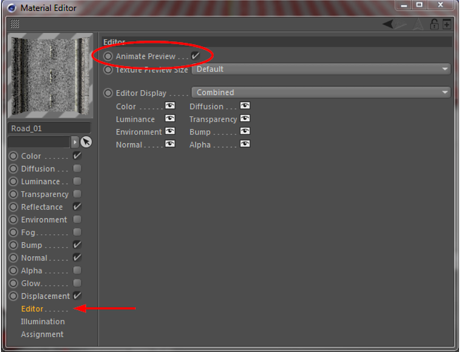

# アニメーション化されたSubstanceのビジュアルフィードバック

Cinema 4DのビューポートでアニメーションSubstanceの視覚的なフィードバックを得るには、これらのマテリアルに対して「アニメーションプレビュー」オプションを有効にする必要があります。

このオプションは、マテリアルエディタのエディタ（下記参照）にあります。 「マテリアルを作成」コマンドを使用してマテリアルを作成した場合、このオプションはデフォルトで有効になっています。

{width="500px"}

## マテリアルを作成中

Substanceアセットマネージャの[マテリアルを作成]コマンドを使用すると、Substanceを使用して簡単かつ迅速にCinema 4D マテリアルを作成できます。

そのため、次のチャンネルマッピングが使用されます。

|  |  |
| --- | --- |
| **Substance出力チャンネル** | **マテリアルチャンネル** |
| ディフューズ | Color |
| 放射 | 輝度 |
| 反射 | 反射率 |
| 環境 | 環境 |
| バンプ | バンプ |
| 不透明度 | アルファ |
| スペキュラ | 反射率/デフォルトSpecular |
| 高さ | ディスプレイスメント |
| 法線 | 法線 |

このリレーションはマテリアル作成コマンドにのみ使用され、作成されたマテリアルは後で変更できます。 このコマンドを使用してベースマテリアルをすばやく作成し、いくつかのチャンネルを微調整するだけで微調整できます。

シェーダーの中には、上記の出力チャンネルに限定されるものではありませんが、実際にはSubstanceが提供する任意の出力チャンネルを使用できます。

## マテリアルの手動作成

「マテリアルを作成」コマンドの代わりに、Substanceシェーダーを使用して手動でマテリアルを作成することもできます。

マテリアルチャンネルでSubstanceシェーダーを選択し、使用するSubstanceにドラッグします。 次のステップでは、このシェーダーで使用するSubstanceの出力チャンネルを選択します。

こんな感じ：

{width="800px"}

この方法を使用すると、クリエイティブな作業が大幅に効率化され、次のことが可能になります。

* Substanceの出力チャンネルを任意のCinema 4Dマテリアルチャンネルに割り当てます。 目的のチャンネルでのみ使用するように制限する必要はありません。
* 1つのSubstance出力チャンネルを複数のCinema 4Dマテリアルチャンネルに割り当てます。
* 複数のSubstanceの出力チャンネルを1つのCinema 4Dマテリアルに割り当てます。

## 制限

* 入力パラメーターのキーフレームはタイムラインに表示されますが、Cinema 4DのPowerslider（ビューポートの下のタイムラインスライダー）には表示されません。
* Substanceの出力チャンネルにはカスタムカラープロファイルを使用できないという制限があります。
* 特定の状況では、Substanceの画像入力が中断される場合があります\
  Cinema 4Dの「結合…」コマンド。2つのシーンを1つに結合します。 これは、マージするシーンのプロジェクトディレクトリにSubstanceがあり、プロジェクトディレクトリ内のイメージを参照するイメージ入力がある場合に発生します。 このような場合、画像入力はその後、手動で再リンクする必要があります。
* Substanceがプロジェクトフォルダー（またはグローバル検索パスの別の場所）に存在する場合、Cinewareでは機能しません。 この場合、Substanceが見つからないかのように赤色でレンダリングされます。 この問題を回避するには、Substanceアーカイブをプロジェクトディレクトリの外部に保存して、絶対パスで参照する必要があります。 ファイルがプロジェクトパスの外部に移動された後に、 Filenameパラメーターを使用してファイルの場所を変更できます。
