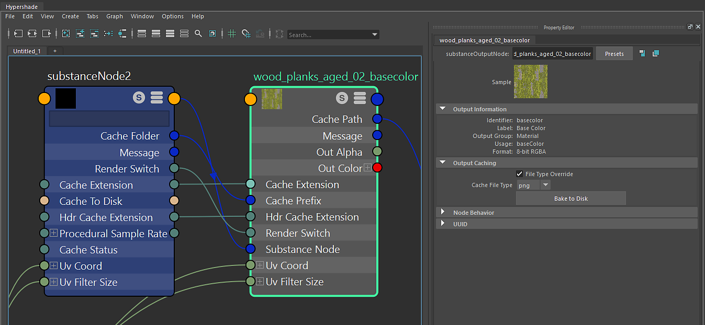

# Substance出力ノード

Substance出力ノードは、Substance engineから計算されたテクスチャへの参照です。 Substanceノードに接続されています。 Substanceノードに出力が作成されると、Substanceエンジンはテクスチャを計算し、このデータはRAMに保持されます。 GPU エンジンを使用する場合、データはGPUで計算され、Substance GPU ブレンドエンジンを使用してメモリに返されます。 アクティブ化されていないSubstanceノードの出力は計算されません。

このノードでは、出力の識別子、ラベル、使用状況セットなどの出力Substance Designerが表示されます。 「出力キャッシュ」セクションでテクスチャをディスクにベイクすることもできます。
