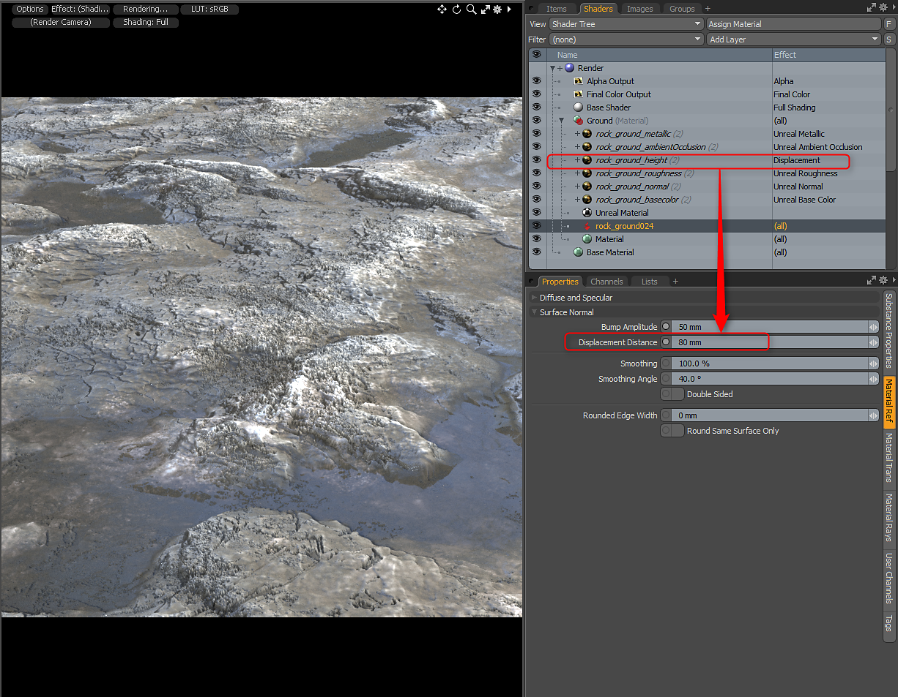

# バンプとディスプレイスメント

バンプとディスプレイスメントの操作

Substanceには、オプションのHeight出力を指定できます。 これをディスプレイスメントまたはバンプとして使用できます。 Heightを有効にすると、バンプテクスチャ効果が適用されます。 Unityの場合はUnity Bumpに設定され、UnrealはUnreal Bumpになります。 次に、「Substance項目」マテリアルを選択し、それに応じてバンプの振幅を設定します。 このHeightをマテリアルとして使用する場合は、「ディスプレイスメントレイヤー効果」を「サーフェスのシェーディング/ディスプレイスメント」に変更します。 次に、[参照]マテリアルで、適切な[ディスプレイスメントの距離]を設定します。

この例では、Unrealマテリアルを使用しましたが、Unreal Bump Layerエフェクトをディスプレイスメントに変更しました。 次に、[Substance項目]マテリアルで[ディスプレイスメントの距離]を設定し、それに応じてレンダリング再分割レベルを設定します。

