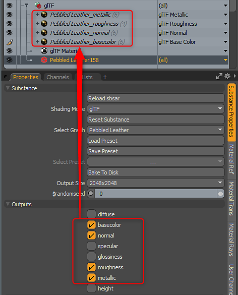

# パラメーター

Substanceには、一連のコアパラメーターがあります。 これらのパラメータは、Substance、出力、およびツィークに分けられます。 これらは、 Substanceのプロパティパネルにあります。\
Substance SourceからのSubstanceには、テクニカルパラメーターとチャンネルが含まれます。 MODOでは、チャンネルオプションは無効です。 出力は、「出力」セクションを使用して有効または無効にします。

{width="300px"}

## Substance

Substanceには一連のコアパラメーターがあります。コアパラメーターは、 Substanceのプロパティパネルの「 Substance 」カテゴリにあります。

* **Substanceの再読み込み：**&#x200B;このパラメーターを使用すると、Substanceを再読み込みできます。 これは、Substance Designerで使用するように設計されています。 カスタムSubstanceで作業していて、新しいツイークまたは出力を追加した場合、新しくパブリッシュしたSubstanceを再びMODOに再ロードできます。 新しいツイークと出力が追加され、以前のツイーク設定は残ります。
* **シェーディングモード：**&#x200B;このパラメーターを使用すると、Substanceに使用するシェーディングモードを設定できます。 Principled （デフォルト）、Unreal、Unity、またはglTFです。
* **Substanceのリセット：**&#x200B;このパラメーターは、調整を既定の設定にリセットします。
* **グラフの選択：** Substanceファイルのどのグラフからマテリアルを作成するかを選択できます。
* **プリセットの読み込み：**&#x200B;プリセットを読み込んで、Substanceの微調整パラメーターを構成できます。 プリセットは、Substance Playerを使用して作成できます。 プリセットファイルのファイルタイプは.sbsprsです。 プリセットを読み込んだら、プリセットドロップダウンをクリックしてプリセットを選択する必要があります。.sbsprには複数のプリセットが含まれている場合があります。
* **プリセットの保存：**&#x200B;プリセットを保存できます
* **プリセットを選択：** Substanceファイルに埋め込まれたプリセット、またはMODO内に保存されたプリセットから埋め込まれたプリセットを選択できます。
* **ディスクにベイク：**&#x200B;このパラメーターは、Substanceによって生成されたテクスチャをビットマップファイルにベイクします。
* **出力サイズ：**&#x200B;このパラメーターは、設定されたサイズに合わせてテクスチャのサイズを動的に変更します。 Substance engineは、テクスチャを適切なサイズに再生成します。
* **ランダムシード：**&#x200B;このパラメーターは、Substanceの手続き型の生成を変更します。 このパラメーターは、同じSubstanceのランダム化されたバージョンを作成する場合に便利です。 これにより、Substanceパラメーターをすばやく変更して、新しいバージョンのテクスチャを作成できます

## 出力

「出力」オプションを使用すると、Substance出力を有効または無効にできます。 出力は、Substance engineによって生成され、シェーダツリーにテクスチャとしてレンダリングされます。

{width="300px"}

## 微調整

ツイークは、Substanceファイルで作成され、MODOで編集できるパラメータです。 チャンネルを選択し、項目モードでチャンネルホールを使用して、ポップアップコントローラ内のコントロールを一緒に取得することができます。

{width="300px"}
