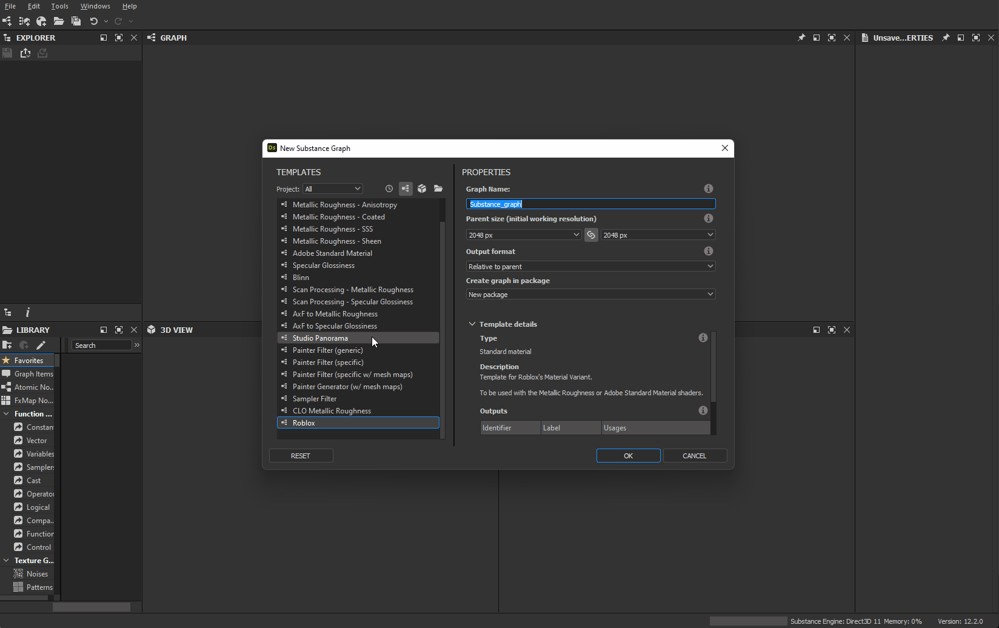

# ロブロックス

[Roblox](https://www.roblox.com/)は、没入型の3Dマルチプレイヤー体験のためのプラットフォームです。 RobloxデザインツールであるRoblox Studioは、PBRメタリック粗さワークフローをサポートしています。

<table>
<tr style="border: 0;">
<td width="58.30%" style="border: 0;" valign="top">

## Substance 3D Designerテンプレート

Robloxのテクスチャを作成するには、以下のSubstance 3Dファイルを[Substance 3D Designer](https://experienceleague.adobe.com/en/docs/substance-3d-designer/home)の[Substance合成グラフ](https://experienceleague.adobe.com/ja/docs/substance-3d-designer/using/substance-graphs/substance-compositing-graphs)テンプレートとして使用できます。

[{width="64px"}](https://helpx.adobe.com/content/dam/roblox.sbs)

このグラフテンプレートを使用すると、最終的なテクスチャファイルの名前とタイプを事前に設定できます。 このテンプレートをインストールして再利用することで、常にRobloxマテリアルのガイドラインに従う新しいマテリアルを作成できます。

</td>
<td width="41.60%" style="border: 0;" valign="top">

{width="200px"}

</td>
</tr>
</table>

## DesignerからRobloxへのワークフロー

<table>
<tr style="border: 0;">
<td style="border: 0;" valign="top">

### テンプレートをインストール

まず、Robloxテンプレートを&#x200B;*インストール*&#x200B;します。

* 上記でリンクされたテンプレートファイルをダウンロードします。
* Designerのユーザードキュメントディレクトリに移動します。
* （Creative Cloudデスクトップ） `/Documents/Adobe/Adobe Substance 3D Designer`\
  （蒸気） `/Documents/Allegorithmic/Substance Designer/`
* テンプレートフォルダーを作成します。
* そのフォルダーにファイルを配置します。

</td>
<td style="border: 0;" valign="top">

{width="512px"}

</td>
</tr>
</table>

<table>
<tr style="border: 0;">
<td style="border: 0;" valign="top">

### テンプレートを検出

次に、Designerにテンプレートフォルダーの&#x200B;*視聴*&#x200B;を依頼して、グラフテンプレートを検索します。

* Designerで、**編集/環境設定…**&#x200B;に移動します
* [環境設定](https://experienceleague.adobe.com/ja/docs/substance-3d-designer/using/workspace/preferences/preferences-window)ウィンドウで、**プロジェクト/ユーザープロジェクト/一般**&#x200B;に移動します
* **テンプレートディレクトリ**&#x200B;のリストで、**+**&#x200B;ボタンをクリックします
* `templates`ディレクトリに移動し、**[フォルダーの選択]**&#x200B;をクリックします
* 「**OK**」ボタンをクリックします
* **ファイル/新規/グラフ...**&#x200B;に移動します
* [新しいテンプレートグラフ](https://helpx.adobe.com/jp/substance-3d/unlisted/documentation/sddoc/create-a-graph-102400068.html)ウィンドウのテンプレート一覧の下部に`Roblox` Substanceが表示されていることを確認してください

</td>
<td style="border: 0;" valign="top">

{width="512px"}

</td>
</tr>
</table>

<table>
<tr style="border: 0;">
<td style="border: 0;" valign="top">

### テクスチャを書き出し

Robloxテンプレートを使用してグラフを作成し、マテリアルの操作が完了したら、そのグラフからビットマップを書き出します。

* [新しいSubstance グラフ](https://helpx.adobe.com/jp/substance-3d/unlisted/documentation/sddoc/create-a-graph-102400068.html)ウィンドウで、`Roblox`テンプレートを選択します
* グラフの識別子とその他のパラメーターを設定し、[**OK**]をクリックします
* [ワークフロー](https://experienceleague.adobe.com/ja/docs/substance-3d-designer/using/workspace/graph-view/the-graph-view)でマテリアルを操作します。グラフビューの使用を開始するには、[ここ](https://experienceleague.adobe.com/ja/docs/substance-3d-designer/using/getting-started/workflow-overview)を参照してください
* 完了したら、グラフビュー&#x200B;*ツールバー*&#x200B;で&#x200B;**ツール/ビットマップを書き出し…**&#x200B;に移動します
* [ビットマップの書き出し](https://experienceleague.adobe.com/ja/docs/substance-3d-designer/using/substance-graphs/exporting-bitmaps)ウィンドウで、有効な&#x200B;**宛先**&#x200B;パスを設定し、出力が&#x200B;*オン*&#x200B;になっていることを&#x200B;*すべて*&#x200B;確認して、**書き出し**&#x200B;をクリックします
* テクスチャが&#x200B;**宛先**&#x200B;パスに正しくエクスポートされていることを確認してください

</td>
<td style="border: 0;" valign="top">

{width="512px"}

</td>
</tr>
</table>

<table>
<tr style="border: 0;">
<td style="border: 0;" valign="top">

### Robloxでマテリアルを作成

Robloxで、マテリアルバリアントを作成し、Designerから書き出したテクスチャを割り当てます。

* 「**モデル**」タブを選択し、**マテリアルマネージャー**&#x200B;をクリックします
* *マテリアルテンプレート*&#x200B;を選択し、**「バリアントを作成」**&#x200B;をクリックします
* **バリアントを作成**&#x200B;ウィンドウで、マテリアルの名前を設定します
* *各マテリアルチャンネル*&#x200B;で、「**読み込み**」ボタンをクリックして、Designerから書き出された対応するテクスチャを選択します
* 「**保存**」をクリックします

</td>
<td style="border: 0;" valign="top">

{width="512px"}

</td>
</tr>
</table>

<table>
<tr style="border: 0;">
<td style="border: 0;" valign="top">

### マテリアルの適用

Roblox シーンで新しいマテリアルバリエーションを使用する

* Roblox シーン内のパーツまたはメッシュを&#x200B;*選択*&#x200B;します
* **マテリアルマネージャー**&#x200B;で、*マテリアルバリエーション*&#x200B;を選択し、**選択したパーツに適用**&#x200B;ボタンをクリックします

>[!NOTE]
>
> Robloxでテクスチャの色が異なって見える場合は、マテリアルバリアントが適用されるオブジェクトのプロパティで&#x200B;**Appearance**&#x200B;カテゴリの&#x200B;**Color**&#x200B;属性を確認し、*純白* (RGB (255、255、255))に設定されていることを確認してください。この値には、Robloxで&#x200B;*Institutional white*&#x200B;というラベルが付いています。

</td>
<td style="border: 0;" valign="top">

{width="512px"}

</td>
</tr>
</table>

<table>
<tr style="border: 0;">
<td style="border: 0;" valign="top">

### タイリングを調整

サーフェス上でのマテリアルの繰り返し量(タイリング)はいつでも調整できます。

* **マテリアルマネージャー**&#x200B;で、*マテリアルバリエーション*&#x200B;を選択し、**編集**&#x200B;をクリックします
* **バリエーションの編集**&#x200B;ウィンドウで、**追加**&#x200B;の下の&#x200B;**タイルあたりのスタッド**&#x200B;プロパティの値を調整します。*低い*&#x200B;値を指定すると、*多く*&#x200B;繰り返されます

</td>
<td style="border: 0;" valign="top">

{width="512px"}

</td>
</tr>
</table>
