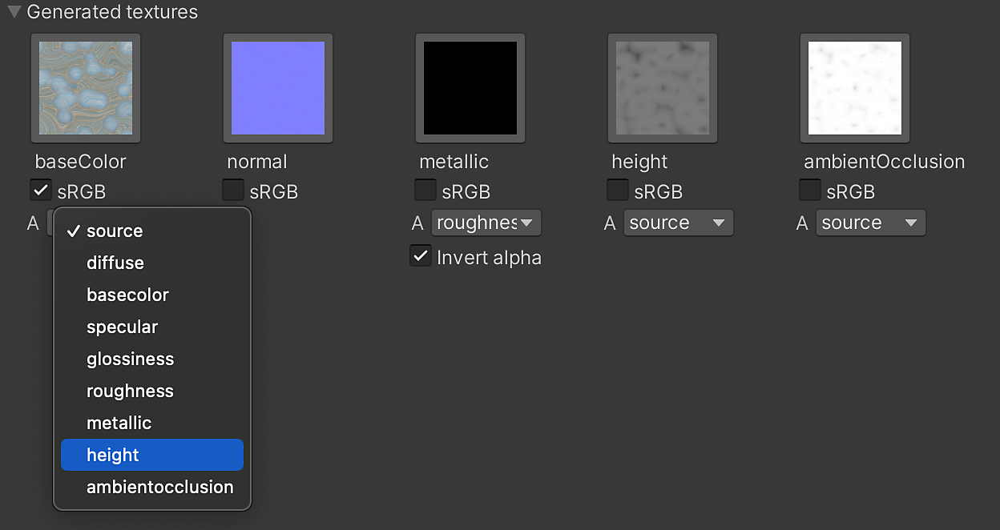

# 生成されたテクスチャ(パッキング)

生成されたテクスチャは、テクスチャを作成するためにSubstance engineによって計算された、Substanceからの出力を示します。 これらのテクスチャは、シェーダー入力に入力されます。 デフォルトでは、シェーダーで使用されるベース入力のみが作成されます。 「すべての出力を生成」が有効な場合は、すべてのテクスチャがここに表示されます。

「すべての出力を生成」が有効な場合

## 使用状況

1. テクスチャアイコンを選択すると、プロジェクトウィンドウ内のテクスチャが選択されます。 テクスチャがプロジェクトフォルダーで生成されないため、ランタイムマテリアルでは機能しません。
1. sRGBボタンは、 テクスチャ読み込み設定の「 sRGB（カラーテクスチャ） 」オプションと同様に機能します。 テクスチャをガンマ空間(sRGB)で変換するか、リニア化するかを指定できます。 Substanceプラグインはこの変換を自動的に処理しますが、必要に応じて上書きすることができます。

   | Substance出力 | sRGB |
   | --- | --- |
   | ベースカラー | 有効にする |
   | ディフューズ | 有効にする |
   | スペキュラ | 有効にする |
   | 法線 | 無効 |
   | メタリック | 無効 |
   | 粗さ | 無効 |
   | グロシネス | 無効 |
   | 高さ | 無効 |
   | アンビエントオクルージョン | 無効 |

## パッキングチャンネル

ドロップダウンメニューを使用して、テクスチャを別のテクスチャのアルファチャンネルにパックできます。 生成された各テクスチャには、Substanceマテリアルによって生成されたすべてのテクスチャ出力のリストを含むドロップダウンメニューがあります。 リストからマップを選択して、テクスチャのアルファチャンネルにパックします。 ソースオプションは、テクスチャのアルファチャンネルです。

この図では、高さマップを選択しています。

次の図では、Height出力がbase colorマップのアルファチャンネルにパックされています。

## 出力テクスチャマッピング

さらに、出力テクスチャマッピングセクションを使用して、Unityマテリアルのサーフェス入力に個別に出力テクスチャを割り当てることができます。 .sbsarによって生成された出力テクスチャは左側の列に表示され、利用可能なUnity Surface Inputsは右側の列に表示されます。 その後は、ドロップダウンを使用して変更できます。

