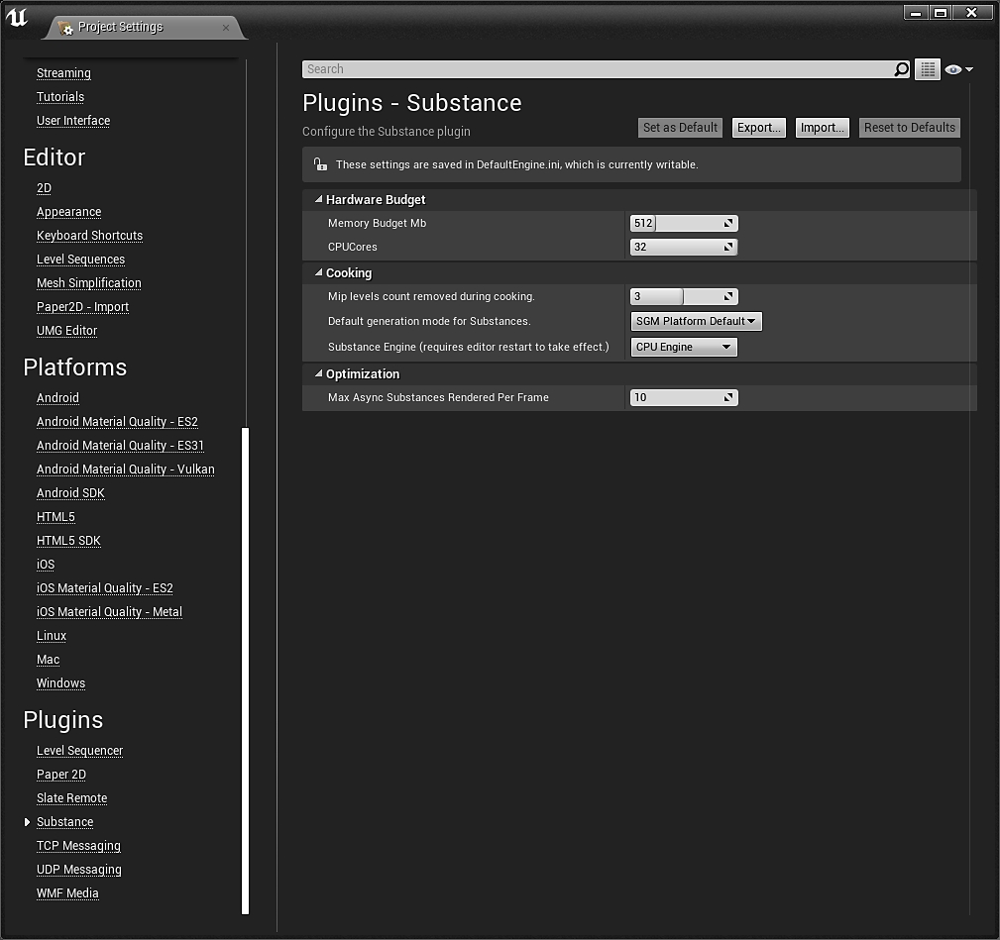

# プラグイン設定 – UE4

設定にアクセスするには、編集/プロジェクト設定に移動し、「プラグイン」カテゴリまで下にスクロールして、「Substance」をクリックします。

{width="400px"}

## ハードウェア予算

メモリバジェットは、Substanceエンジンに使用するメモリの最大量です。 物質の処理速度を上げるために増やすことができますが、システムリソースの消費量が増えます。 （プロジェクトレベルでは、必ずしも役に立つ増加ではありません）。

CPUコア数は、Substanceエンジンで使用可能なコアの数です。 これには、物理コアとハイパースレッドの両方が含まれます。 (割り当てられている数がシステムで使用可能なコア数より大きい場合は、デフォルトですべての使用可能コアが使用されます。

## 料理

調理中に取り除かれたMIPレベルカウントにより、パッケージのテクスチャの作成方法が変わります。 この設定により、大きなテクスチャミップレベルを読み込む必要がなくなるため、読み込み時間が大幅に短縮され、パッケージサイズが小さくなります。 低い解像度/小さいLODがロードされ、UE4によって最高のLODがデフォルト設定されます。 その後、物質エンジンを介して物質が処理され、実行時に高解像度のLODで更新されます。

Substance engineはCPUまたはGPUです。 GPUエンジンを使用すると、4Kテクスチャを作成できます。 CPUエンジンの上限は2Kです。

## デフォルトの生成：

Substance生成モード(SGM)は、テクスチャの生成方法を制御します。 これは、Substanceのグローバル設定です。 SGMは、Substanceファクトリに基づいてSubstanceごとに変更できます。

**SGMベイク処理** :サブスタンステクスチャをベイク処理します。 実行時にパラメーターを変更する機能が失われます。

**Load SyncのSGM**: Substanceの読み込み中にアプリケーションをブロックします。

**ロード同期時およびキャッシュ時のSGM**:テクスチャの中間結果をディスク上にキャッシュします。

**Load AsyncのSGM**:ブロックしていません。 Substanceはバックグラウンドで生成されます。

**非同期およびキャッシュの読み込み時のSGM**:ディスク上のテクスチャの中間結果をキャッシュします。

***プラットフォームの既定はLoad Async and Cache***&#x200B;です

## Substanceファクトリ

アセットのSGMを変更するには、Substanceファクトリ/Substanceアクション/プロパティマトリクスを介した一括編集を右クリックします。 その後、SGMを変更できます。

{width="800px"}

## 最適化：

これにより、各バッチでsubstanceエンジンに渡すことができる非同期物質の数が制限されます。 数値を小さくすると、非同期タスクの完了速度が速くなり、更新されます。数値を大きくすると、複数のサブスタンスのバッチレンダリングおよび処理を一度に行うことができます。 （値が大きいほど、テクスチャの更新間隔が長くなるため、テクスチャの更新間隔が大きくなります）。

## 非同期/同期レンダリング

同期レンダリングは、ブロッキングレンダリング呼び出しです。 これにより、Substance Graphインスタンスが再計算されるSubstanceエンジンに渡されますが、SubstanceエンジンによるSubstanceの処理が完了するまで実行が停止されてから、コードの実行が続行されます。 結果は、処理が完了するとすぐに画面で更新されます。

Asyncは、プラグインのアップデート中に、グラフをキューに追加し、複数のグラフをSubstanceエンジンに一度に（Substance設定内から設定して）送信します。 同期レンダリングとは異なり、送信されるとすぐに、Substanceエンジンが完了するのを待たずにプログラムが通常のように実行されます。 Substanceエンジンがそのバッチを完了すると、結果が返されます。次に、その結果を出力に適用して、別のバッチを開始します。
