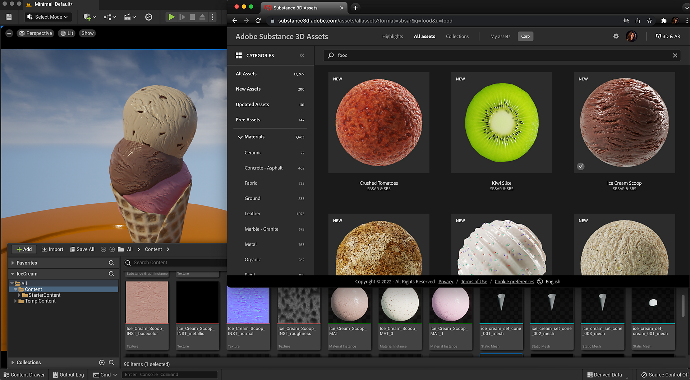

# Substance 3D Assetsライブラリの使用 – UE5

[Substance 3Dアセットライブラリ](https://helpx.adobe.com/substance-3d/unlisted/assets.html)のプリセットで、微調整および書き出し対応の1000以上の高品質の4Kマテリアルにアクセスできます。 [コミュニティアセットライブラリ](https://helpx.adobe.com/substance-3d/unlisted/community-assets.html)で、コミュニティが提供するアセットを検索できます。

アセットライブラリからマテリアルをダウンロードして、UE5で使用できます。

