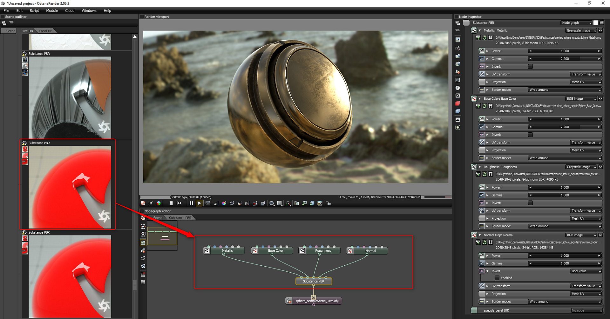

# オクタン

オクタンは、スタンドアロンレンダラーまたはDCCプラグインを使用して、Substance出力をレンダリングするために使用できます。 ライブDBマテリアルを通じて、Octane Standaloneはbase color、メタリック、ラフネスに基づいたSubstance出力をサポートします。

**オクタンスタンドアロン**\
**Live DB/マテリアル/その他**&#x200B;で、「**Substance PBR**」マテリアルを見つけます。

## 目次

* [3ds Maxのオクタン](../../renderers/octane/octane-for-3ds-max/octane-for-3ds-max.md)
* [MODOのオクタン](../../renderers/octane/octane-for-modo/octane-for-modo.md)
